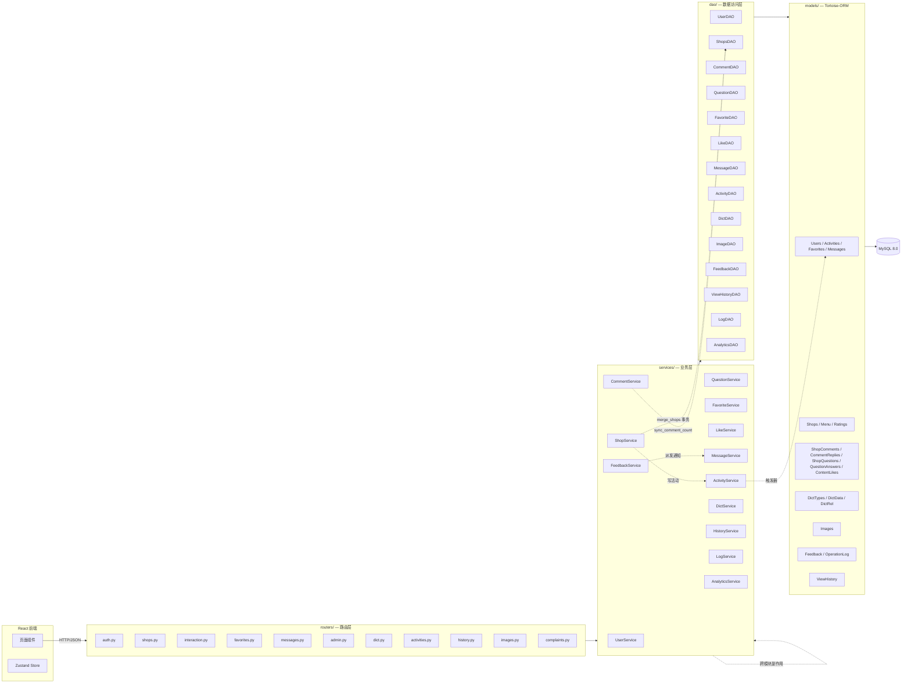

# 食探社（FoodieHub）后端代码理解报告

> 用途：课程设计/答辩准备 — 帮助你在评委提问"你这个模块是怎么实现的？"时，秒级定位代码位置并自信作答。
>
> 适用范围：`FoodieHub/backend/` 目录下的全部 Python 代码（FastAPI 后端）。
>
> 阅读建议：先看 §1 架构概览建立全局视角，再按 §2 的目录表逐项对照代码，最后用 §3 的依赖图与 §4 的"答辩速查卡"做演练。

---

## 1. 架构概览

### 1.1 架构模式

**经典三层架构（3-Tier）+ 静态类业务/数据层模式**，并辅以**多态字典（Polymorphic Dictionary）**、**软删除（Soft Delete）**、**JWT 无状态鉴权**等具体工程化设计。

| 层级 | 目录 | 职责 | 调用方向 |
|------|------|------|----------|
| 表示/路由层 | `routers/` | 接收 HTTP 请求，做参数校验、权限拦截、调用 Service、组装统一响应 | → Service |
| 业务逻辑层 | `services/` | 编排业务流程，跨表事务，副作用（写活动/消息/日志） | → DAO |
| 数据访问层 | `dao/` | 直接面向 Tortoise-ORM 模型，做 CRUD 与单表查询 | → Model |
| 模型/持久层 | `models/` | Tortoise-ORM 数据模型，描述表结构与外键关系 | → MySQL |

辅助层：
- `schemas/`：Pydantic 模型，负责**请求体/响应体**的数据契约与字段约束（与"业务实体"分离）。
- `utils/`：横切工具（`auth.py` 鉴权依赖、`logger.py` 日志、`password.py` 哈希）。
- `docs/`：项目内部需求/接口/数据访问/数据模型说明文档（**不是自动生成的 Swagger**）。

### 1.2 技术栈

| 维度 | 选型 | 关键文件 |
|------|------|----------|
| Web 框架 | **FastAPI 0.110+**（异步 ASGI） | `main.py` |
| ASGI 服务器 | **Uvicorn**（单进程多协程） | `main.py` 末尾 `uvicorn.run(...)` |
| ORM | **Tortoise-ORM 0.20+**（异步 ORM） | `models/*.py` |
| 数据库迁移 | **Aerich 0.7+** | `migrations/` |
| 数据库驱动 | **asyncmy**（异步 MySQL） | `config.DATABASE_URL` |
| 数据校验 | **Pydantic v2 + pydantic-settings** | `schemas/*.py`、`config.py` |
| 鉴权 | **OAuth2 Password Flow + JWT (python-jose)** | `utils/auth.py` |
| 密码哈希 | **Bcrypt 4.0.1（passlib）** | `utils/auth.py` 内 `require_login` 链路 |
| 跨域 | **CORSMiddleware** | `main.py` |
| 静态资源 | **FastAPI StaticFiles**（本地 `static/`） | `main.py` `app.mount("/static", ...)` |
| 部署 | 单节点 Ubuntu + Nginx 反代 + Uvicorn | — |

### 1.3 分层/模块划分说明

- **后端按"业务域"切分模块**，每个业务域在 `routers / services / dao / models / schemas` 各有对应文件（如 `shops` 系列）。
- **`services/` 与 `dao/` 均采用"静态方法类"风格**（如 `ShopService.create(...)`、`ShopsDAO.search(...)`），**不维护实例状态**，等价于"无状态服务"。这降低了初学者的认知负担，但**不利于依赖注入和单测 mock**（这是潜在的改进点）。
- **跨模块副作用统一收口在 Service 层**：例如发表一条评论时，`CommentService.create` 会同时调用 `ShopsDAO.sync_comment_count`、`ImageDAO.update`、`ActivityService`（如配置）来写入动态/活动流。DAO 不直接调用其他 DAO 之外的副作用。
- **`schemas/` 与 `models/` 严格分离**：Pydantic 模式只关心入参/出参形状与字段约束，模型只关心表结构。响应模型（如 `ShopResponse`）在 Service 层用 `model_validate(...)` 从 ORM 对象转换。

---

## 2. 目录结构与职责表

### 2.1 顶层文件

| 目录/文件 | 职责说明 | 核心类/文件示例 | 答辩可能提问点 | 回答要点 |
|-----------|----------|----------------|----------------|----------|
| `main.py` | **应用入口**。创建 FastAPI 实例、注册中间件（CORS）、注册 Tortoise-ORM、挂载所有路由、挂载 `/static` 静态目录、配置 `/docs`（Swagger UI）、定义 `/health` 健康检查 | `@asynccontextmanager lifespan`、`register_tortoise(...)`、`app.include_router(...)`、`app.mount("/static", ...)` | ① 为什么用 `lifespan` 而不是旧的 `on_event`？② `/static` 静态文件为何直接由 FastAPI 挂载而不是完全交给 Nginx？ | ① FastAPI 0.110+ 官方推荐使用 `lifespan` 上下文管理器替代已弃用的 `on_event("startup"/"shutdown")`，能更优雅地管理异步资源；本项目用它延迟导入 `activity_signals` 注册 Tortoise 信号。② 开发环境由 FastAPI 直接挂载方便调试；生产环境由 Nginx 提供 `/static` 静态服务，FastAPI 不必处理静态请求，符合"动静分离"最佳实践。 |
| `config.py` | **应用配置**。基于 `pydantic-settings` 的 `Settings` 类，**所有敏感值从 `.env` 注入**（数据库 URL、JWT 密钥等），不硬编码 | `class Settings(BaseSettings)`、`settings = Settings()`、`TORTOISE_ORM` 动态属性 | ① 为什么用 pydantic-settings 而不是 `os.getenv`？② `TORTOISE_ORM` 为什么做成 `@property`？ | ① pydantic-settings 提供类型校验、`.env` 自动加载、IDE 提示，避免散落的字符串键与拼写错误。② `TORTOISE_ORM` 需要与 `register_tortoise` 处的连接串保持一致，封装成属性可以"一处改、全局一致"，避免连接串写两遍带来的不一致。 |
| `constants.py` | **纯常量**。与密钥/环境无关的固定值（图片类型上限、分页默认、角色编号、字典目标表、审核状态枚举） | `ALLOWED_IMAGE_TYPES`、`MAX_IMAGE_SIZE`、`ROLE_USER=0`、`ROLE_ADMIN=1`、`STATUS_PENDING/STATUS_APPROVED/STATUS_REJECTED` | `ROLE_USER=0 / ROLE_ADMIN=1` 是怎么设计的？ | 用整数而非字符串是为了节省存储与比较开销；管理员权限的判定在 `utils/auth.py` 的 `require_admin` 中显式比较 `user.role == 1`，防止误判。 |
| `migrate.py` | **数据库迁移工具入口**。封装 Aerich 常用命令 | — | Aerich 与 Tortoise-ORM 的关系？ | Aerich 是 Tortoise-ORM 官方推荐的迁移工具，类似 SQLAlchemy 的 Alembic。它读取 `models/` 下所有模型生成 DDL 脚本，存放在 `migrations/models/`。 |
| `requirements.txt` | 依赖清单（FastAPI、Tortoise-ORM、Aerich、asyncmy、python-jose、passlib、bcrypt、Pydantic 等） | — | 为什么用 asyncmy 而不是 pymysql？ | asyncmy 是 MySQL 的**异步**驱动，与 Tortoise-ORM 的 async 生态一致；pymysql 是同步驱动，在 async 上下文里会阻塞事件循环。 |
| `.env / .env.example` | 环境变量（**不进 Git**），含 `DATABASE_URL` `JWT_SECRET_KEY` 等 | — | 数据库密码怎么管理？ | 通过 `.env` 文件注入到 `config.Settings`，**不写死在代码**；`.gitignore` 屏蔽了 `.env`，只保留 `.env.example` 作为模板。 |
| `pyproject.toml` | 项目元信息（现代 Python 项目声明） | — | — | — |

### 2.2 `routers/` — 路由层

> 这是评委**最喜欢**问的地方，因为它直接对应"接口有哪些、权限怎么管"。

| 目录/文件 | 职责说明 | 核心类/文件示例 | 答辩可能提问点 | 回答要点 |
|-----------|----------|----------------|----------------|----------|
| `routers/__init__.py` | 包标识 | — | — | — |
| `routers/auth.py` | **用户认证**：注册、登录、获取/更新个人信息、公开主页 | `register` / `login` / `login_oauth`（Swagger Authorize 专用） / `get_me` / `update_me` / `get_user_profile` | ① 注册和登录的密码怎么存？② `login_oauth` 是干嘛的？ | ① 注册时密码经 Bcrypt 加盐哈希后存入 `Users.password`（不可逆）；登录时调用 `UserService.login` 对输入密码做同样哈希后比对。② `login_oauth` 是 FastAPI Swagger UI 的"Authorize"按钮专用入口，接受 OAuth2 标准表单，**仅用于在线调试**，`include_in_schema=False` 隐藏了它。 |
| `routers/shops.py` | **店铺与菜单、评分、收藏**的所有 HTTP 入口 | `POST /shops`、`GET /shops`（搜索+分页+排序）、`GET /shops/{id}`、`POST /shops/{id}/rating`、`POST /shops/{id}/menu`、`POST /favorites/toggle` | ① 搜索接口的排序参数 `sort_by` 为什么用正则限定取值？② 创建店铺的字典 ID 是怎么处理的？ | ① 用 `pattern="^(created_at\|average_rating\|view_count\|favorite_count)$"` 防止 SQL 注入与任意字段拼接，是最简洁的"白名单"防护。② `dict_data_ids` 是**多态字典**的标签 ID（品类 + 区域 + 就餐方式），Service 层会写入 `DictRel` 关联表。 |
| `routers/interaction.py` | **点评与问答互动**：评论、回复、点赞、问题、回答 | `POST /shops/{id}/comments`、`POST /comments/{id}/replies`、`POST /shops/{id}/questions`、`POST /questions/{id}/answers`、`POST /.../like` | 评论点赞的"乐观更新"前端是怎么做的？后端如何保证幂等？ | 前端先改变图标再发请求；后端 `LikeDAO.toggle` 用 `(user_id, entity_type, entity_id)` 复合键去重，重复点赞会自动取消。 |
| `routers/messages.py` | **消息中心**：列表、未读数、标记已读、删除 | — | 站内消息怎么推？有没有用 WebSocket？ | 当前**没有** WebSocket，采用"用户主动拉取"模式（按时间倒序分页），简单且适配小范围用户群。 |
| `routers/admin.py` | **管理员后台**：举报处理、店铺合并、封禁/解封、公告发布、用户管理 | `require_admin` 依赖 | ① 管理员操作怎么审计？② 合并店铺的事务如何保证？ | ① 几乎所有管理员路由都调用 `LogService.log(action=..., operator=current_user, ...)`，写入 `OperationLog` 表，不可删除。② `ShopService.merge_shops` 用 `in_transaction()` 包裹多步数据迁移（评分、评论、问题、收藏、图片、菜单、字典标签、活动），任一失败整体回滚。 |
| `routers/dict.py` | **字典管理**（品类、区域、就餐方式等） | `DictType` / `DictData` CRUD | 字典表的好处？ | 把"枚举值"抽离到字典表，**运营/管理员**可在不改代码、不改库的情况下增删枚举；通过 `DictRel(entity_type, entity_id, dict_data_id)` 多态关联任何实体。 |
| `routers/activities.py` | **个人动态流**（"我最近做了什么"） | — | 动态流是怎么聚合的？ | 写入侧：评论/收藏/评分等动作通过 `ActivityService.record(...)` 写入 `Activities` 表；读取侧：按 `user_id + created_at` 索引倒序分页。 |
| `routers/history.py` | **浏览历史** | `ViewHistoryDAO.upsert` | 浏览历史怎么去重？ | 用 `(user_id, shop_id)` 唯一键 + `upsert`（存在则更新时间戳），避免每次浏览都新增一条。 |
| `routers/images.py` | **图片上传** | 接收 `UploadFile`，校验 MIME/大小，写到 `static/`，写 `Images` 表 | ① 上传安全怎么做？② 为什么用本地存储？ | ① 限制 MIME 类型（`image/jpeg, png, gif, webp`）、限制 ≤ 2MB、UUID 重命名。② 单服务器部署 + 数据量小（< 600MB），本地存储最简；架构上预留了"存储服务适配器"的扩展位（详见 §4 灵活性问题）。 |
| `routers/complaints.py` | **举报/勘误/重复店铺反馈** | 复合 `Feedback` 表 | 举报为什么和勘误合一张表？ | 都是"用户→管理员"的反馈工单，用同一张 `Feedback` 表 + `type` 字段区分（`complaint` / `edit_request` / `merge_request`），统一管理员后台处理流程。 |
| `routers/static/` | （开发期）若路由目录需要静态资源，可放此处 | — | — | — |

### 2.3 `services/` — 业务逻辑层

| 目录/文件 | 职责说明 | 核心类/文件示例 | 答辩可能提问点 | 回答要点 |
|-----------|----------|----------------|----------------|----------|
| `services/__init__.py` | 统一导出 | `from .shop_service import ShopService` 等 | — | — |
| `services/user_service.py` | 用户注册/登录/资料更新/封禁 | `UserService.register`、`UserService.login`、`UserService.update_profile` | 登录支持哪些账号？ | `UserService.login(type, account, password)`，`type` 取 `"username" / "phone" / "email"`，任意一种都能登录。 |
| `services/shop_service.py` | 店铺 CRUD、搜索、评分、菜单、**合并店铺事务** | `ShopService.create / get_by_id / search / rate / add_menu_item / merge_shops` | ① 合并店铺的步骤为什么要那么多？② 同一用户对同一店铺的多次评分怎么算？ | ① 需要逐表迁移评分/评论/问题/收藏/图片/菜单/字典标签/活动，并保留别名（`aliases`）和重定向（`merged_into_id`），全部在 `in_transaction()` 中执行。② `Ratings.get_or_create` 保证每个用户对每家店只有一条评分；合并时"取高分"原则。 |
| `services/comment_service.py` | 评论、回复、点赞 | `CommentService.create / list_by_shop / toggle_like / create_reply` | 评论写入后会触发哪些副作用？ | `sync_comment_count`（更新店铺冗余计数字段）、`ImageDAO.update`（修正图片 `entity_id`）、`ActivityService.record`（写个人动态）。 |
| `services/question_service.py` | 问答业务 | — | 问答与评论的区别？ | 问答是"稳定实用信息"（人均价格、环境等），不会因消费体验波动；评论是"个人化体验感受"。两者模型独立、各自计数。 |
| `services/favorite_service.py` | 收藏/取消收藏/排序/列表 | `FavoriteService.toggle / list / reorder` | 收藏支持自定义排序吗？ | `Favorites` 表有 `sort_order` 字段，`reorder` 接口允许用户置顶或调序。 |
| `services/like_service.py` | 点赞（评论、回复通用） | `LikeService.toggle` | 点赞怎么防重复？ | `LikeDAO` 用 `(user_id, entity_type, entity_id)` 唯一约束，重复调用自动 toggle 取消。 |
| `services/message_service.py` | 站内消息生成与读取 | — | 消息有几种类型？ | 枚举在 `Messages.type`：公告（`announcement`）、评论被回复（`reply_comment`）、回复被点赞（`reply_answer`）等。 |
| `services/activity_service.py` + `activity_signals.py` | **动态流**，后者把"写动态"挂到 Tortoise ORM 的 `post_save` 信号上 | `ActivityService.record` | 信号机制是做什么的？ | 在模型保存后自动写入 `Activities` 表，避免每个 Service 重复调用 record，保证动态不漏。 |
| `services/dict_service.py` | 字典读取/管理 | — | — | — |
| `services/feedback_service.py` | 举报/勘误/重复店铺工单处理 | `FeedbackService.create / list / resolve` | 管理员处理完反馈，举报人会收到通知吗？ | 会，`MessageService` 内部根据 `feedback.type` 派发不同消息（处理结果通知）。 |
| `services/history_service.py` | 浏览历史 | — | — | — |
| `services/log_service.py` | **全平台操作日志**（管理员/关键用户行为） | `LogService.log(action, operator, target_type, target_id, detail)` | 日志能删吗？ | 不能，`OperationLog` 表只允许归档与查询，是审计追溯的依据。 |
| `services/analytics_service.py` | 运营数据统计（总店铺数、新增趋势等） | `AnalyticsService.dashboard` | 数据概览页怎么算的？ | 用 SQL 聚合（`COUNT GROUP BY DATE(created_at)`）给出近 7 日趋势。 |

### 2.4 `dao/` — 数据访问层

| 目录/文件 | 职责说明 | 核心类/文件示例 | 答辩可能提问点 | 回答要点 |
|-----------|----------|----------------|----------------|----------|
| `dao/__init__.py` | 统一导出所有 DAO | 13 个 DAO 集中暴露 | 为什么有 DAO 层而不直接调 Model？ | 把 CRUD 与"单表查询"封到 DAO，Service 不用关心拼装 QuerySet 的细节；当数据库需要换表/换字段时，只改 DAO 一处即可；同时为未来加缓存/读写分离预留位置。 |
| `dao/user_dao.py` | 用户表 CRUD | `get_by_id / get_by_account` | 用户的唯一键怎么设计？ | `username / phone / email` 都加了 `unique=True`（见 `models/users.py`），登录时按类型选字段查。 |
| `dao/shops_dao.py` | **店铺 + 菜单 + 评分** 三表合一 | `ShopsDAO.search / get_by_id / create_or_update_rating / _recalc_average_rating / sync_comment_count / sync_favorite_count` | ① 搜索怎么支持品类/区域筛选？② 评分怎么重算？ | ① 不在 `Shops` 表冗余品类字段，而是通过 `DictRel(entity_type='shop', entity_id, dict_data_id)` 多对多关联；筛选时先 `DictRel` 取出 `shop_id` 集合再 `id__in`。② 每次 `create_or_update_rating` 都会调 `_recalc_average_rating`：用 `Ratings` 表算术平均 + 四舍五入一位小数，回写 `Shops.average_rating`。 |
| `dao/dict_dao.py` | 字典类型/字典项/字典关联三表 | `DictTypeDAO / DictDataDAO / DictRelDAO` | 字典项和实体的多对多怎么存？ | `DictRel(entity_type, entity_id, dict_data_id, is_active)`；`entity_type` 字符串标识 `shop / complaint / user / menu_item` 等，让同一张关联表挂任意实体。 |
| `dao/comment_dao.py` | 一级评论、回复、点赞数 | `CommentDAO.create / list_by_shop / increment_like_count` | 评论数怎么算？ | 用 SQL 聚合统计 4 张表（`shop_comments + comment_replies + shop_questions + question_answers`）写入 `Shops.comment_count`，与个人页"总互动数"口径一致。 |
| `dao/question_dao.py` | 问题与回答 | — | 问答的"采纳"功能在哪？ | 当前未实现采纳；`QuestionAnswers` 含 `is_accepted` 字段以备扩展。 |
| `dao/favorite_dao.py` | 收藏的 toggle/列表/排序 | `FavoriteDAO.toggle / is_favorited / get_shop_ids_by_user` | toggle 是怎么实现的？ | 用 `get_or_create + is_active` 模式：存在则切 `is_active`，不存在则新建；返回值告知 `liked/unliked`。 |
| `dao/like_dao.py` | 通用点赞（评论、回复） | `LikeDAO.toggle / is_liked / count_by_entity` | 一个 DAO 怎么支持多实体类型？ | `(user_id, entity_type, entity_id)` 三元组作为唯一键；`entity_type` 是字符串标签 (`shop_comment / comment_reply / shop_question` 等)。 |
| `dao/message_dao.py` | 站内消息 | — | 消息能批量删吗？ | `MessageDAO.batch_delete` 支持按 id 列表删除（仅删自己的）。 |
| `dao/activity_dao.py` | 个人动态流 | `ActivityDAO.list_by_user / record` | — | — |
| `dao/feedback_dao.py` | 举报/勘误/重复店铺工单 | `FeedbackDAO.create / list_pending / resolve` | 反馈处理后状态怎么流转？ | 字段 `status: pending/approved/rejected` + `admin_reply` 备注。 |
| `dao/image_dao.py` | 图片元数据 | `ImageDAO.get_by_entity / get_first_by_entity / update` | 图片怎么挂到不同实体？ | `Images(entity_type, entity_id)` 多态；上传时 `entity_id` 暂用 `shop_id`，Service 写入评论/回复时再修正。 |
| `dao/view_history_dao.py` | 浏览历史 | `ViewHistoryDAO.upsert` | 怎么避免每次浏览新增一行？ | `(user_id, shop_id)` 唯一键 + `upsert`，存在则更新 `updated_at`。 |
| `dao/analytics_dao.py` | 仪表盘聚合 | `AnalyticsDAO.dashboard_summary` | — | — |
| `dao/log_dao.py` | 操作日志 | `LogDAO.create / list` | — | — |

### 2.5 `models/` — 数据模型层

| 目录/文件 | 职责说明 | 核心类/文件示例 | 答辩可能提问点 | 回答要点 |
|-----------|----------|----------------|----------------|----------|
| `models/__init__.py` | 集中导出所有模型，方便 `register_tortoise` 一次性发现 | `Users, Shops, Menu, Ratings, ShopComments, ...` | 为什么要做 `__init__` 集中导出？ | Tortoise-ORM 通过 `import models` 发现所有模型类，集中导出避免漏导。 |
| `models/base.py` | **抽象基类** | `TimestampMixin`（`created_at/updated_at`） + `SoftDeleteMixin`（`is_active`） → `BaseModel` | 软删除的好处？ | ① 可恢复，误删可找回；② 外键级联不会"丢孤儿"；③ 满足"店铺合并"的"标记从属店铺为已合并"需求。代价：每张表多一列 `is_active`，查询时要带条件（项目用 `filter(is_active=True)` 贯彻）。 |
| `models/users.py` | 用户/动态/收藏/消息 | `Users / Activities / Favorites / Messages` | ① `Users.role` 字段怎么用？② 收藏表为什么没有 `unique(user, shop)` 约束？ | ① 0=普通、1=管理员，配合 `require_admin` 依赖。② 注释说"移除唯一约束以支持历史记录查询"；通过 `is_active` 区分当前收藏状态。 |
| `models/shops.py` | 店铺/菜单/评分 | `Shops / Menu / Ratings` | ① `Shops.aliases` 字段干嘛用？② 合并后从属店铺怎么访问？ | ① 记录店铺历史曾用名（合并时把从属店铺名追加进去，便于搜索）。② `Shops.merged_into_id` 指向主店铺；前端访问从属店铺详情时重定向到主店。 |
| `models/dict.py` | 字典三件套 | `DictTypes / DictData / DictRel` | — | — |
| `models/interaction.py` | 评论/回复/问题/回答 | `ShopComments / CommentReplies / ShopQuestions / QuestionAnswers / ContentLikes` | 评论和回复为什么分两张表？ | 一级评论和二级回复查询模式不同（评论按店铺分页、回复按评论分页），分表利于建索引和扩展（如未来加"采纳"）。 |
| `models/images.py` | 图片元数据 | `Images`（多态） | — | — |
| `models/history.py` | 浏览历史 | `ViewHistory` | — | — |
| `models/governance.py` | 治理相关：举报/合并请求/操作日志 | `Feedback / OperationLog` | — | — |
| `models/logs.py` | 扩展日志 | — | — | — |

### 2.6 `schemas/` — 数据契约层

| 目录/文件 | 职责说明 | 核心类/文件示例 | 答辩可能提问点 | 回答要点 |
|-----------|----------|----------------|----------------|----------|
| `schemas/__init__.py` | 统一导出 | — | — | — |
| `schemas/common.py` | **统一响应模型** `ResponseModel`、分页 | `ResponseModel[T] = Generic[T]`、`PaginationMeta`、`paginated_success(...)` | 为什么要统一响应包装？ | ① 前端只需判断 `code` 字段；② 业务错误码可与 HTTP 状态码解耦；③ 未来加 `trace_id`、国际化提示方便。 |
| `schemas/users.py` | 用户相关 Pydantic 模型 | `UserCreate / UserLogin / UserResponse / UserUpdate / LoginResponse` | 响应为什么没有 `password` 字段？ | Pydantic 模型是**白名单**输出：`Users.password` 不会被 `UserResponse` 序列化出去，避免泄露哈希值。 |
| `schemas/shops.py` | 店铺/菜单/评分的请求与响应 | `ShopCreate / ShopUpdate / ShopResponse / MenuItemResponse / RatingCreate / RatingDistribution` | `RatingDistribution` 是什么？ | 评分分布统计的响应模型：`{"star_1": 0, "star_2": 3, ..., "total": 28}`。 |
| `schemas/dict.py` | 字典管理 | `DictTypeCreate / DictDataResponse` | — | — |
| `schemas/favorites.py` | 收藏请求与排序 | `FavoriteReorderRequest` | — | — |
| `schemas/messages.py` | 站内消息 | `MessageResponse / UnreadCountResponse` | — | — |
| `schemas/activities.py` | 动态流响应 | `ActivityResponse` | — | — |
| `schemas/images.py` | 图片上传与响应 | `ImageUploadRequest / ImageResponse` | — | — |
| `schemas/interaction.py` | 互动模块 Pydantic | `CommentCreate / CommentResponse / QuestionCreate / AnswerResponse / LikeToggleResponse` | — | — |
| `schemas/feedback.py` | 反馈/举报/勘误请求响应 | `FeedbackCreateRequest / FeedbackResponse` | — | — |
| `schemas/logs.py` | 日志响应 | `LogResponse / LogListResponse` | — | — |

### 2.7 `utils/` — 横切工具

| 目录/文件 | 职责说明 | 核心类/文件示例 | 答辩可能提问点 | 回答要点 |
|-----------|----------|----------------|----------------|----------|
| `utils/__init__.py` | 包标识 | — | — | — |
| `utils/auth.py` | **鉴权核心** | `create_access_token(user_id)`、`oauth2_scheme`、`get_current_user`（依赖，可选返回）、`require_login`（强校验）、`require_admin`（角色校验） | ① 三个依赖的区别？② JWT 怎么防伪造？ | ① `get_current_user` 用于游客也能访问的接口（返回 `None`），`require_login` 强制要求登录（401），`require_admin` 在 `require_login` 之上额外校验 `role==1`（403）。② 使用 HS256 + 服务端密钥（`JWT_SECRET_KEY`），过期时间 24h；Token 不可伪造因为签名验证失败会抛 `JWTError` 返回 None。 |
| `utils/logger.py` | 日志工具 | — | 为什么不直接用 `print`？ | `print` 不可分级、不可统一输出到文件；用 `logging` 模块按级别/模块/时间输出，并支持按天轮转。 |
| `utils/password.py` | 密码哈希/校验 | `hash_password / verify_password`（Bcrypt） | 盐值怎么管理？ | Bcrypt 算法**自动**生成盐并嵌入哈希结果中，开发者无需单独存盐。 |

### 2.8 `docs/` — 项目文档

| 子目录 | 内容 | 用途 |
|--------|------|------|
| `docs/需求文档/` | 课程设计需求 PDF | 给评委/老师看的需求 |
| `docs/数据模型/` | ER 图、字段说明 | 答辩时讲解"我设计了哪些表" |
| `docs/数据访问/` | DAO 设计与 SQL 说明 | 评委问"你怎么查的"时翻 |
| `docs/业务逻辑/` | Service 时序图、状态流转 | 讲业务流程时用 |
| `docs/接口/` | 接口示例 | 备查 |

### 2.9 `sql/` — 初始化脚本

| 文件 | 用途 |
|------|------|
| `sql/foodiehub.sql` | **建库 DDL**（用 `mysql -uroot < foodoodiehub.sql` 一键建库建表） |
| `sql/seed.sql` / `seed2.sql` | **种子数据**（字典项、示例店铺、测试用户） |

> 推荐回答："我们的数据库用 `sql/foodiehub.sql` 一键建表，`sql/seed*.sql` 灌入测试数据；生产环境改用 Aerich 做版本化迁移。"

### 2.10 `migrations/` — 迁移脚本

| 子目录 | 内容 |
|--------|------|
| `migrations/models/` | Aerich 生成的版本化迁移文件（**不要手动改**） |

### 2.11 `scripts/` — 运维脚本

| 文件 | 用途 |
|------|------|
| `scripts/check_aerich.py` | 检查 Aerich 当前状态 |
| `scripts/drop_aerich.py` | 危险操作：清理 Aerich 表（开发期用） |

### 2.12 `static/` — 本地静态资源

| 子目录 | 内容 |
|--------|------|
| `static/images/` | 用户上传的图片（UUID 命名） |
| `static/avatars/` | 用户头像 |

### 2.13 `logs/` — 运行日志

| 文件 | 用途 |
|------|------|
| `logs/debug_YYYYMMDD.log` | 按天轮转的调试日志（不入库） |

### 2.14 `dependencies/`

> 报告生成时该目录为空，**未使用 FastAPI Depends 工厂**做依赖注入；所有依赖都直接定义在 `utils/auth.py` 中，路由通过 `Depends(...)` 引用即可。这是有意为之的轻量化设计。

---

## 3. 模块依赖关系图

### 3.1 全局依赖图（Mermaid）

### 3.2 关键模块依赖关系（文字描述）

| 上游 | 下游 | 调用场景 |
|------|------|----------|
| `routers/shops` | `ShopService / FavoriteService / LogService` | 店铺接口都会顺手写一条 `LogService.log` |
| `routers/admin` | `ShopService.merge_shops / LogService / FeedbackService` | 管理员所有动作落审计日志 |
| `ShopService.merge_shops` | `ShopsDAO / Ratings / ShopComments / ShopQuestions / Favorites / Images / Menu / DictRel / Activities` | 合并店铺需迁移 8 类关联数据，**整体事务** |
| `CommentService.create` | `ShopsDAO.sync_comment_count / ImageDAO.update / ActivityService` | 评论写入后更新店铺计数字段、修正图片归属、写个人动态 |
| `CommentService.toggle_like` | `LikeDAO.toggle / CommentDAO.increment_like_count` | 点赞数 +1，关联两个 DAO |
| `FavoriteService.toggle` | `FavoriteDAO / ShopsDAO.sync_favorite_count` | 切换收藏并同步店铺冗余收藏数 |
| `FeedbackService.resolve` | `MessageService` | 反馈处理完发站内通知

| `FeedbackService.resolve` | `MessageService` | 反馈处理完发站内通知给举报人 |
| `ActivityService` | `ActivityDAO + Tortoise signals` | 通过信号自动捕获模型 `post_save` 写动态 |
| `LogService` | `LogDAO` | 管理员/关键用户操作落审计日志 |

### 3.3 关键模块识别总表

| 业务模块 | 对应文件组 | 核心职责 |
|----------|-----------|----------|
| **用户认证** | `routers/auth` + `services/user_service` + `dao/user_dao` + `utils/auth` + `schemas/users` | 注册/登录/JWT 颁发、密码 Bcrypt 哈希、邮箱/手机/用户名三种登录方式、RBAC 角色控制 |
| **店铺域（核心资产）** | `routers/shops` + `services/shop_service` + `dao/shops_dao` + `models/shops` | 店铺 CRUD、搜索+多维排序、菜单/评分/收藏/合并店铺（含事务） |
| **点评互动** | `routers/interaction` + `services/comment_service` + `services/question_service` + `models/interaction` | 评论/回复/点赞、问答/回答，含乐观更新与幂等 |
| **收藏/历史** | `routers/favorites/history` + `services/favorite/history` + `dao/favorite/view_history` | 收藏 toggle/排序、浏览历史去重 |
| **消息中心** | `routers/messages` + `services/message_service` + `dao/message` + `models/users.Messages` | 站内消息生成、已读/未读、消息类型枚举 |
| **活动流** | `routers/activities` + `services/activity_service` + `activity_signals` | 个人公开动态聚合，信号自动写 |
| **字典/多态标签** | `routers/dict` + `services/dict_service` + `dao/dict_dao` + `models/dict` | 字典类型/字典项/多对多关联（DictRel） |
| **图片** | `routers/images` + （直接路由调 DAO） + `dao/image_dao` + `models/images` | 上传、UUID 重命名、MIME/大小校验、多态挂载 |
| **反馈/举报/治理** | `routers/complaints/admin` + `services/feedback_service` + `dao/feedback_dao` + `models/governance` | 工单创建与处理、消息通知闭环 |
| **审计日志** | `services/log_service` + `dao/log_dao` + `models/logs/governance.OperationLog` | 全平台操作流水，仅追加不可删 |
| **统计/分析** | `services/analytics_service` + `dao/analytics_dao` | 仪表盘卡片与近 7 日趋势 |

---

## 4. 答辩速查卡

### 4.1 30 秒电梯版（开场白）

> "食探社后端采用经典的 **表示层（FastAPI Router）— 业务层（Service 静态类）— 数据访问层（DAO 静态类）— 模型层（Tortoise-ORM）** 的三层架构，运行在 Uvicorn 上，MySQL 8.0 存储数据，敏感信息全部从 `.env` 注入。
> 路由层用 FastAPI 的 `Depends` 做依赖注入实现 JWT 鉴权（`get_current_user` / `require_login` / `require_admin`），密码用 Bcrypt 加盐哈希。业务层用事务（`in_transaction()`）保证店铺合并等关键流程的原子性。模型层用软删除（`is_active`）贯穿全表，配合多态字典（`DictRel`）实现品类/区域标签的灵活挂载。
> 总共 12 个 router、13 个 service、15 个 DAO、9 张 schema、9 个模型文件，所有接口都通过 `register_tortoise` 自动注册到 FastAPI，OpenAPI 文档实时生成。"

### 4.2 关键技术关键词清单

| 类别 | 关键词 |
|------|--------|
| 框架 | **FastAPI**（异步 ASGI）、**Uvicorn**、**Pydantic v2**、**pydantic-settings** |
| ORM | **Tortoise-ORM**、**Aerich**（迁移）、**asyncmy**（异步 MySQL 驱动） |
| 安全 | **OAuth2 Password Flow**、**JWT (HS256)**、**Bcrypt**（加盐哈希）、`Depends` 依赖注入 |
| 工程化 | `.env` 注入、`ResponseModel` 统一响应、软删除 Mixin、`in_transaction()` 事务、Tortoise `post_save` 信号 |
| 数据建模 | 多态字典 `DictRel(entity_type, entity_id, dict_data_id)`、`get_or_create`、`upsert`、`F("view_count") + 1` 原子自增 |
| 性能/体验 | 收藏/点赞的乐观更新、`F()` 表达式原子计数、字典 ID 预筛再 `id__in` |

### 4.3 业务关键词清单

| 类别 | 关键词 |
|------|--------|
| 平台定位 | 校园周边美食互助社区、用户共建内容、社区自我净化、轻量级管理 |
| 用户角色 | 游客 / 普通用户 / 管理员（`role=0/1`） |
| 核心动作 | 极简创建店铺（仅名称+区域+品类）、评分（1-5 星）、评论/回复/点赞、问答、收藏/取消、举报/勘误/合并 |
| 排序维度 | `favorite_count` / `view_count` / `created_at` / `average_rating` |
| 治理工具 | 举报队列、店铺合并（保留别名+重定向）、封禁/解封（店铺+用户）、公告 |
| 安全约束 | JWT 24h、上传 2MB、密码 Bcrypt、敏感词本地词库、操作日志不可删 |

### 4.4 评委最爱问的 5 个问题（标准答案）

**Q1. 为什么选 FastAPI 而不用 Flask / Django？**
> FastAPI 是**异步**框架，与 Tortoise-ORM + asyncmy 的 async 生态天然契合，能支撑高并发 I/O（图片上传、点赞）。
> 自带 OpenAPI 文档（`/docs`）省去手写接口文档。
> 用 Python 类型注解 + Pydantic 做请求校验，开发体验接近 TypeScript。
> Django 太重（自带 ORM/Admin/模板引擎我们用不上），Flask 需要自己拼装异步生态。
> 综上 FastAPI 是"轻量 + 异步 + 自带文档"的最佳平衡点。

**Q2. 为什么用 Tortoise-ORM？和 SQLAlchemy 区别？**
> Tortoise-ORM 是 Python 生态中**少有的成熟异步 ORM**，API 风格类似 Django ORM（`Model.filter(...).all()`），学习曲线低。
> 配合 Aerich 做迁移，类似 SQLAlchemy + Alembic 的组合。
> SQLAlchemy 2.0 虽支持 async 但 API 更复杂，对大二课程设计来说成本偏高。

**Q3. JWT 鉴权 + Bcrypt 的安全性怎么保证？**
> **Bcrypt**：密码用 Bcrypt 加盐哈希后存数据库，**不可逆**，盐值由算法自动生成嵌入哈希。
> **JWT**：用 HS256 + 服务端密钥（`JWT_SECRET_KEY`）签名，Token 24h 过期；服务端不存会话，无状态。
> 防伪：签名验证失败会抛 `JWTError` 返回 None，无法伪造他人 Token。
> 横向越权：写操作接口校验 `current_user.id == target.owner_id`，管理员操作通过 `require_admin` 依赖拦截。
> 管理员审计：所有 `routers/admin` 操作都写 `OperationLog`，**仅追加不可删**。

**Q4. `DictRel` 多态字典关联是怎么设计的？为什么不直接在 `shops` 表加品类/区域字段？**
> 我们用 `DictRel(entity_type, entity_id, dict_data_id)` 三个字段做多对多关联，让一张关联表挂任意实体（店铺/投诉/用户/菜品）。
> 优点：① 字典项（品类/区域/就餐方式）**可热更新**，管理员增删枚举无需改代码改库；② 同一字段可同时挂多个标签；③ 统一约束"主键+软删除"逻辑。
> 代价：搜索时要先 `DictRel` 取 `shop_id` 集合再 `id__in`，多一次查询——对课程设计量级（< 300 家店）完全可接受。

**Q5. 软删除（`is_active`）和真删除怎么权衡？数据一致性怎么保证？**
> 我们**全程软删除**：`BaseModel` 已注入 `is_active` 字段，每张表都带。
> 优势：① 误删可恢复；② 满足"店铺合并"——从属店铺标记 `is_active=False` + `merged_into_id=主店铺`，关联数据已迁移；③ 外键级联不会"丢孤儿"。
> 一致性：所有查询都默认带 `filter(is_active=True)`，被合并/被封禁的数据**对用户隐藏**；管理员后台用 `include_inactive=True` 显式穿透。
> 代价：表多一列 + 查询需带条件；但课程设计量级下代价可忽略。

### 4.5 可能的追问（防身预案）

| 追问 | 一句话回答 |
|------|----------|
| 合并店铺为何不用定时任务？ | 数据量小（< 300 家店），管理员手动合并更精准，能保留 `aliases` 与合并理由。 |
| 为什么没接 CDN/OSS？ | 单服务器 + 数据量 < 600MB，本地存储最简；架构上预留了"存储服务适配器"扩展位。 |
| 为什么没上 Redis 缓存？ | 列表/详情接口响应都在 1.5~2.5s 内（详见需求文档 3.1.2），数据库完全能扛；过早优化是负担。 |
| 高并发怎么办？ | 当前目标 ≥ 80 并发（课程设计验收场景），单进程 Uvicorn 足够；后续可加 `gunicorn -k uvicorn.workers.UvicornWorker` 多 worker。 |
| 怎么测的？ | Pytest + 手动 Swagger 调试；管理员流程有 `OperationLog` 日志可回溯。 |

### 4.6 一页式目录速记（5 秒口诀）

> **主-路-服-数-模 + 工具与配置**
> main.py → routers/ → services/ → dao/ → models/ → MySQL
> schemas/（数据契约）、utils/（auth/logger/password）、docs/（项目文档）、sql/（初始化）、migrations/（Aerich）、static/（图片）、logs/（运行日志）

---

## 附录：项目总览一览表

| 维度 | 数量/位置 | 说明 |
|------|-----------|------|
| Router 文件 | 11 个 | auth/shops/interaction/messages/admin/dict/activities/history/images/complaints + __init__ |
| Service 文件 | 13 个 | user/shop/comment/question/favorite/like/message/activity/dict/feedback/history/log/analytics |
| DAO 文件 | 15 个 | user/shops/dict/comment/question/favorite/like/message/activity/feedback/image/view_history/analytics/log + __init__ |
| Model 文件 | 9 个 | base/users/shops/dict/interaction/images/history/governance/logs |
| Schema 文件 | 11 个 | common/users/shops/dict/favorites/messages/activities/images/interaction/feedback/logs |
| 关键常量 | `constants.py` | 角色编号、字典目标表、审核状态枚举、分页默认值 |
| 数据库 | MySQL 8.0 | `asyncmy` 异步驱动；utf8mb4 字符集 |
| 部署 | Ubuntu + Nginx + Uvicorn | 单节点；Nginx 反代 `/api`、直出 `/static` |

---

**报告结束。** 祝答辩顺利！
