# 食探社 — 概念结构设计文档

> **版本**：v1.0  
> **分析对象**：`FoodieHub/backend/models/*.py`  
> **分析依据**：`FoodieHub/backend/docs/数据模型/README.md`  
> **设计目标**：识别实体、属性、联系类型、参与约束、键约束，输出可导入专业工具的 ER 图

---

## 目录

1. [概念结构设计概述](#1-概念结构设计概述)
2. [PlantUML ER 图代码](#2-plantuml-er-图代码)
3. [实体列表](#3-实体列表)
4. [联系列表](#4-联系列表)
5. [特殊说明（多态关联 / 弱实体 / 派生属性）](#5-特殊说明多态关联--弱实体--派生属性)
6. [代码与文档的差异说明](#6-代码与文档的差异说明)
7. [工具使用建议](#7-工具使用建议)
8. [附录：SQL DDL 反向工程脚本](#8-附录sql-ddl-反向工程脚本)

---

## 1. 概念结构设计概述

"食探社"（FoodieHub）是一个以**店铺（Shops）**为核心、围绕**用户（Users）**开展浏览、评分、评论、问答、收藏、举报、勘误等互动行为的美食点评平台。

**核心设计理念：**

- **标签字典化**：所有可枚举的属性（品类、区域、就餐方式等）通过 `DictTypes / DictData / DictRel` 三表体系管理，避免在 `Shops` 表上硬编码字段。
- **多态关联**：图片（`Images`）、字典标签（`DictRel`）、点赞（`ContentLikes`）均采用 `entity_type + entity_id` 通用多态模式，一张表服务多种实体。
- **评论/问答分离**：评论与问答各自独立两级表，扁平回复无嵌套。
- **治理工单化**：举报与勘误合并为统一的 `Feedback` 工单表。
- **日志统一化**：所有用户/管理员操作统一记录在 `OperationLog` 表。
- **封禁独立化**：`is_banned` 独立于软删除 `is_active`，不混用。

**模型分层与数量**（基于代码）：

| 层级 | 模型 | 数量 |
|:---|:---|:---:|
| 字典体系 | DictTypes, DictData, DictRel | 3 |
| 用户模块 | Users, Activities, Favorites, Messages | 4 |
| 店铺模块 | Shops, Menu, Ratings | 3 |
| 资源模块 | Images | 1 |
| 互动模块 | ShopComments, CommentReplies, ShopQuestions, QuestionAnswers, ContentLikes | 5 |
| 浏览历史 | ViewHistory | 1 |
| 治理模块 | Feedback | 1 |
| 日志模块 | OperationLog | 1 |
| 基础 | BaseModel（抽象基类，非实体） | 0 |
| **合计实体** | | **19** |

---

## 2. PlantUML ER 图代码

以下 PlantUML 代码采用「E-R 实体-联系图」标注法，可直接复制保存为 `.puml` 文件后渲染。

```plantuml
@startuml FoodieHub_ER

' ============================================================
'  食探社 - 概念结构 ER 图
'  生成方式: PlantUML  (https://plantuml.com/er-diagram)
'  渲染: plantuml 概念结构设计.puml  或
'        plantuml -tpng 概念结构设计.puml
' ============================================================

hide circle
skinparam linetype ortho
skinparam classAttributeIconSize 0
skinparam classFontSize 12
skinparam packageFontSize 14

' ============================================================
'  一、字典体系 (dict)
' ============================================================
package "字典体系" {

  entity "DictTypes\n<<字典类型>>" as DictTypes {
    * id : INT <<PK>>
    --
    * name : VARCHAR(50) <<UK>>
    * target_table : VARCHAR(50)
    description : VARCHAR(255)
    sort_order : INT
  }

  entity "DictData\n<<字典数据>>" as DictData {
    * id : INT <<PK>>
    --
    * dict_type_id : INT <<FK>>
    * name : VARCHAR(50)
    sort_order : INT
    is_default : BOOLEAN
    extra : JSON
  }

  entity "DictRel\n<<字典多态关联>>" as DictRel {
    * id : INT <<PK>>
    --
    * entity_type : VARCHAR(32)
    * entity_id : BIGINT
    * dict_data_id : INT <<FK>>
  }
}

' ============================================================
'  二、用户模块 (users)
' ============================================================
package "用户模块" {

  entity "Users\n<<用户>>" as Users {
    * id : INT <<PK>>
    --
    * username : VARCHAR(50) <<UK>>
    * password : VARCHAR(255)
    * phone : VARCHAR(20) <<UK>>
    * email : VARCHAR(100) <<UK>>
    avatar : VARCHAR(255)
    bio : TEXT
    gender : VARCHAR(10)
    * role : INT (0=user, 1=admin)
    is_banned : BOOLEAN
  }

  entity "Activities\n<<动态>>" as Activities {
    * id : INT <<PK>>
    --
    * user_id : INT <<FK>>
    * type : VARCHAR(50)
    * target_id : INT
    * target_type : VARCHAR(50)
    content : VARCHAR(255)
    shop_id : INT <<FK, NULL>>
  }

  entity "Favorites\n<<收藏>>" as Favorites {
    * id : INT <<PK>>
    --
    * user_id : INT <<FK>>
    * shop_id : INT <<FK>>
    * sort_order : INT
  }

  entity "Messages\n<<消息>>" as Messages {
    * id : INT <<PK>>
    --
    * recipient_id : INT <<FK>>
    sender_id : INT <<FK, NULL>>
    * type : VARCHAR(50)
    title : VARCHAR(100)
    * content : TEXT
    related_entity_type : VARCHAR(50)
    related_entity_id : INT
    is_read : BOOLEAN
  }
}

' ============================================================
'  三、店铺模块 (shops)
' ============================================================
package "店铺模块" {

  entity "Shops\n<<店铺>>" as Shops {
    * id : INT <<PK>>
    --
    * name : VARCHAR(100)
    view_count : INT
    favorite_count : INT
    comment_count : INT
    average_rating : FLOAT
    aliases : JSON
    merged_into_id : INT <<FK, NULL, self>>
    is_banned : BOOLEAN
  }

  entity "Menu\n<<菜单项>>" as Menu {
    * id : INT <<PK>>
    --
    * shop_id : INT <<FK>>
    * name : VARCHAR(100)
    price : FLOAT
    description : TEXT
  }

  entity "Ratings\n<<评分>>" as Ratings {
    * id : INT <<PK>>
    --
    * user_id : INT <<FK>>
    * shop_id : INT <<FK>>
    * score : INT (1-5)
  }
}

' ============================================================
'  四、资源模块 (images)
' ============================================================
package "资源模块" {

  entity "Images\n<<图片>>" as Images {
    * id : BIGINT <<PK>>
    --
    * url : VARCHAR(255)
    * entity_type : VARCHAR(32)
    * entity_id : BIGINT
    file_size : INT
    width : INT
    height : INT
    mime_type : VARCHAR(50)
    extra : JSON
  }
}

' ============================================================
'  五、互动模块 (interaction)
' ============================================================
package "互动模块" {

  entity "ShopComments\n<<一级评论>>" as ShopComments {
    * id : BIGINT <<PK>>
    --
    * shop_id : INT <<FK>>
    * user_id : INT <<FK>>
    * content : TEXT
    like_count : INT
    reply_count : INT
  }

  entity "CommentReplies\n<<二级回复>>" as CommentReplies {
    * id : BIGINT <<PK>>
    --
    * comment_id : BIGINT <<FK>>
    * user_id : INT <<FK>>
    * content : TEXT
    reply_to_user_id : INT <<FK, NULL>>
    like_count : INT
  }

  entity "ShopQuestions\n<<一级问题>>" as ShopQuestions {
    * id : BIGINT <<PK>>
    --
    * shop_id : INT <<FK>>
    * user_id : INT <<FK>>
    * title : VARCHAR(100)
    content : TEXT
    like_count : INT
  }

  entity "QuestionAnswers\n<<二级回答>>" as QuestionAnswers {
    * id : BIGINT <<PK>>
    --
    * question_id : BIGINT <<FK>>
    * user_id : INT <<FK>>
    * content : TEXT
    reply_to_user_id : INT <<FK, NULL>>
    like_count : INT
  }

  entity "ContentLikes\n<<内容点赞>>" as ContentLikes {
    * id : BIGINT <<PK>>
    --
    * user_id : INT <<FK>>
    * entity_type : VARCHAR(32)
    * entity_id : BIGINT
  }
}

' ============================================================
'  六、浏览历史
' ============================================================
package "浏览历史" {

  entity "ViewHistory\n<<浏览历史>>" as ViewHistory {
    * id : INT <<PK>>
    --
    * user_id : INT <<FK>>
    * shop_id : INT <<FK>>
    * viewed_at : DATETIME
  }
}

' ============================================================
'  七、治理模块
' ============================================================
package "治理模块" {

  entity "Feedback\n<<统一反馈>>" as Feedback {
    * id : INT <<PK>>
    --
    * user_id : INT <<FK>>
    * type : VARCHAR(20) [complaint|edit_request]
    * target_type : VARCHAR(20)
    * target_id : INT
    * reason_id : INT <<FK>>     ' -> DictData
    description : TEXT
    * status : VARCHAR(20)
    admin_id : INT <<FK, NULL>>
  }
}

' ============================================================
'  八、日志模块
' ============================================================
package "日志模块" {

  entity "OperationLog\n<<操作日志>>" as OperationLog {
    * id : BIGINT <<PK>>
    --
    operator_id : INT <<FK, NULL>>
    operator_name : VARCHAR(50)
    * action : VARCHAR(50)
    * target_type : VARCHAR(50)
    target_id : INT
    detail : JSON
    ip_address : VARCHAR(45)
    user_agent : TEXT
    session_id : VARCHAR(64)
  }
}

' ============================================================
'  继承关系（软删除 / 时间戳 Mixin）
'  注：BaseModel 为抽象基类，仅展示继承结构
' ============================================================
note bottom of Users
  所有实体继承自 **BaseModel**（抽象基类）：
  - created_at : DATETIME
  - updated_at : DATETIME
  - is_active  : BOOLEAN  (软删除标记)
  OperationLog 同样继承 BaseModel。
end note

' ============================================================
'  实体间联系
' ============================================================

' --- 字典体系 ---
DictTypes ||--o{ DictData      : "1:N (CASCADE)"
DictData  ||--o{ DictRel       : "1:N (CASCADE)"

' --- Users 与多模块的多重联系 ---
Users ||--o{ Activities       : "产生 (1:N)"
Users ||--o{ Favorites        : "收藏 (1:N)"
Users ||--o{ Ratings          : "评分 (1:N)"
Users ||--o{ ShopComments     : "评论 (1:N)"
Users ||--o{ CommentReplies   : "回复 (1:N)"
Users ||--o{ ShopQuestions    : "提问 (1:N)"
Users ||--o{ QuestionAnswers  : "回答 (1:N)"
Users ||--o{ ContentLikes     : "点赞 (1:N)"
Users ||--o{ ViewHistory      : "浏览 (1:N)"
Users ||--o{ Feedback         : "反馈 (1:N, 提交人)"
Users ||--o{ Feedback         : "审核 (1:N, admin)"
Users ||--o{ OperationLog     : "操作 (1:N, 操作用户)"
Users ||--o{ Messages         : "接收 (1:N, recipient)"
Users ||--o{ Messages         : "发送 (1:N, sender)"

' --- Shops 核心联系 ---
Shops ||--o{ Menu             : "拥有 (1:N)"
Shops ||--o{ Ratings          : "被评 (1:N)"
Shops ||--o{ Favorites        : "被收藏 (1:N)"
Shops ||--o{ ShopComments     : "被评论 (1:N)"
Shops ||--o{ ShopQuestions    : "被提问 (1:N)"
Shops ||--o{ ViewHistory      : "被浏览 (1:N)"
Shops ||--o{ Activities       : "动态关联 (1:N)"
Shops ||--o{ DictRel          : "打标签 (M:N, via DictRel 多态)"
Shops ||--o{ Shops            : "合并到 (1:N, self-FK merged_into)"

' --- 互动模块内部 ---
ShopComments  ||--o{ CommentReplies   : "拥有 (1:N)"
ShopQuestions ||--o{ QuestionAnswers  : "拥有 (1:N)"

' --- 二级回复/回答的自引用（可选）---
Users ||--o{ CommentReplies   : "被回复 (1:N, reply_to_user)"
Users ||--o{ QuestionAnswers  : "被回复 (1:N, reply_to_user)"

' --- 多态点赞：ContentLikes -> 4种互动内容 ---
ContentLikes }o..|| ShopComments    : "点赞 (polymorphic)"
ContentLikes }o..|| CommentReplies  : "点赞 (polymorphic)"
ContentLikes }o..|| ShopQuestions   : "点赞 (polymorphic)"
ContentLikes }o..|| QuestionAnswers : "点赞 (polymorphic)"

' --- 多态图片：Images -> 多种实体 ---
Images }o..|| Shops            : "图片 (polymorphic)"
Images }o..|| Menu             : "图片 (polymorphic)"
Images }o..|| ShopComments     : "图片 (polymorphic)"
Images }o..|| CommentReplies   : "图片 (polymorphic)"

' --- 多态反馈：Feedback -> shop/comment/image ---
Feedback }o..|| Shops            : "反馈对象 (polymorphic)"
Feedback }o..|| ShopComments     : "反馈对象 (polymorphic)"
Feedback }o..|| Images           : "反馈对象 (polymorphic)"

' --- 多态字典：DictRel -> shop/complaint/user 等 ---
DictRel }o..|| Shops            : "被打标签 (polymorphic)"

' --- Feedback.reason -> DictData ---
DictData ||--o{ Feedback        : "反馈原因 (1:N)"

' --- OperationLog 多态：target ---
OperationLog }o..|| Shops       : "操作对象 (polymorphic)"
OperationLog }o..|| Users       : "操作对象 (polymorphic)"
OperationLog }o..|| Feedback    : "操作对象 (polymorphic)"

@enduml
```



### 如何使用 PlantUML 生成图片

**方式 1 — 本地命令行（推荐）：**

```bash
# 1. 安装 Java 8+ 和 PlantUML
#    下载 plantuml.jar: https://plantuml.com/download
# 2. 在 ER 文件目录下执行：
java -jar plantuml.jar 概念结构设计.puml          # 生成 .png
java -jar plantuml.jar -tpng 概念结构设计.puml    # 同上
java -jar plantuml.jar -tsvg 概念结构设计.puml    # 生成矢量 .svg
```

**方式 2 — 在线渲染：**

1. 打开 [https://www.plantuml.com/plantuml/uml/](https://www.plantuml.com/plantuml/uml/)
2. 将 `@startuml ... @enduml` 中间的内容粘贴进去
3. 自动渲染并下载图片

**方式 3 — VSCode 插件：**

安装 `PlantUML` 扩展（作者 jebbs），打开 `.puml` 文件按 `Alt+D` 预览。

**方式 4 — 导入 PowerDesigner：**

PowerDesigner **不直接支持 PlantUML**，但可以通过本文件**第 8 节的 SQL DDL 脚本**做反向工程：

```
File → Reverse Engineer → Database → 选 MySQL → 选 .sql 文件
```

---

## 3. 实体列表

> **说明**：标 `*` 的为 NOT NULL 约束；`<<PK>>` 主键；`<<UK>>` 唯一键；`<<FK>>` 外键。  
> 所有实体均继承自 `BaseModel`，自动拥有 `id`（自定）、`created_at`、`updated_at`、`is_active` 四个字段。

### 3.1 字典体系

| 实体名 | 属性（含类型、主键标记） | 业务含义 | 约束说明 |
|:---|:---|:---|:---|
| **DictTypes** | `id` INT <<PK>>; `name` VARCHAR(50) <<UK,NOT NULL>>; `target_table` VARCHAR(50) NOT NULL; `description` VARCHAR(255) NULL; `sort_order` INT default 0 | 字典类型表，定义"标签类别"（品类、区域、就餐方式、反馈原因等） | `name` 全表唯一；`target_table` 取值在 `constants.DICT_TARGET_TABLES` 中（应用层校验） |
| **DictData** | `id` INT <<PK>>; `dict_type_id` INT <<FK,NOT NULL>>; `name` VARCHAR(50) NOT NULL; `sort_order` INT default 0; `is_default` BOOLEAN default False; `extra` JSON NULL | 具体的标签值（火锅、华农西门、堂食等） | `(dict_type_id, name)` 联合唯一；`extra` 用于存储图标/颜色等扩展 |
| **DictRel** | `id` INT <<PK>>; `entity_type` VARCHAR(32) NOT NULL; `entity_id` BIGINT NOT NULL; `dict_data_id` INT <<FK,NOT NULL>> | 字典多态关联，将任意实体挂上标签 | `(entity_type, entity_id, dict_data_id)` 联合唯一；索引 `(entity_type, entity_id)` |

### 3.2 用户模块

| 实体名 | 属性（含类型、主键标记） | 业务含义 | 约束说明 |
|:---|:---|:---|:---|
| **Users** | `id` INT <<PK>>; `username` VARCHAR(50) <<UK,NOT NULL>>; `password` VARCHAR(255) NOT NULL; `phone` VARCHAR(20) <<UK,NOT NULL>>; `email` VARCHAR(100) <<UK,NOT NULL>>; `avatar` VARCHAR(255) NULL; `bio` TEXT NULL; `gender` VARCHAR(10) NULL; `role` INT NOT NULL default 0; `is_banned` BOOLEAN default False | 平台用户/管理员 | `username`、`phone`、`email` 均全表唯一；`role` 枚举 0=普通用户、1=管理员；`is_banned` 与 `is_active` 解耦 |
| **Activities** | `id` INT <<PK>>; `user_id` INT <<FK,NOT NULL>>; `type` VARCHAR(50) NOT NULL; `target_id` INT NOT NULL; `target_type` VARCHAR(50) NOT NULL; `content` VARCHAR(255) NULL; `shop_id` INT <<FK,NULL>> | 用户主页时间线动态（评论/评分/收藏/提问等摘要） | 索引 `(user_id, created_at)`；`shop_id` 可空，NULL 表示非店铺类动态 |
| **Favorites** | `id` INT <<PK>>; `user_id` INT <<FK,NOT NULL>>; `shop_id` INT <<FK,NOT NULL>>; `sort_order` INT NOT NULL default 0 | 收藏关系 | 无 `(user_id, shop_id)` 唯一约束（允许历史记录）；索引 `(user_id, created_at)`；`is_active` 实现 toggle 软删 |
| **Messages** | `id` INT <<PK>>; `recipient_id` INT <<FK,NOT NULL>>; `sender_id` INT <<FK,NULL>>; `type` VARCHAR(50) NOT NULL; `title` VARCHAR(100) NULL; `content` TEXT NOT NULL; `related_entity_type` VARCHAR(50) NULL; `related_entity_id` INT NULL; `is_read` BOOLEAN default False | 站内消息（公告/回复/点赞/审核结果等） | 索引 `(recipient_id, created_at)`；`sender_id` NULL 时表示系统消息 |

### 3.3 店铺模块

| 实体名 | 属性（含类型、主键标记） | 业务含义 | 约束说明 |
|:---|:---|:---|:---|
| **Shops** | `id` INT <<PK>>; `name` VARCHAR(100) NOT NULL; `view_count` INT default 0; `favorite_count` INT default 0; `comment_count` INT default 0; `average_rating` FLOAT default 0.0; `aliases` JSON NULL; `merged_into_id` INT <<FK,self,NULL>>; `is_banned` BOOLEAN default False | 店铺核心实体 | `merged_into` 自引用外键（合并目标店铺，SET NULL）；`is_banned` 独立于 `is_active` |
| **Menu** | `id` INT <<PK>>; `shop_id` INT <<FK,NOT NULL>>; `name` VARCHAR(100) NOT NULL; `price` FLOAT NULL; `description` TEXT NULL | 菜单项（菜品） | 菜品图片通过 `Images` 多态管理（`entity_type='menu_item'`） |
| **Ratings** | `id` INT <<PK>>; `user_id` INT <<FK,NOT NULL>>; `shop_id` INT <<FK,NOT NULL>>; `score` INT NOT NULL | 用户对店铺的 1-5 星评分 | `(user_id, shop_id)` 联合唯一（每个用户对每个店铺只能评分一次） |

### 3.4 资源模块

| 实体名 | 属性（含类型、主键标记） | 业务含义 | 约束说明 |
|:---|:---|:---|:---|
| **Images** | `id` BIGINT <<PK>>; `url` VARCHAR(255) NOT NULL; `entity_type` VARCHAR(32) NOT NULL; `entity_id` BIGINT NOT NULL; `file_size` INT NULL; `width` INT NULL; `height` INT NULL; `mime_type` VARCHAR(50) NULL; `extra` JSON NULL | 多态图片表 | **无 FK 约束**（主动选择），级联删除在 DAO 层处理；索引 `(entity_type, entity_id)` |

### 3.5 互动模块

| 实体名 | 属性（含类型、主键标记） | 业务含义 | 约束说明 |
|:---|:---|:---|:---|
| **ShopComments** | `id` BIGINT <<PK>>; `shop_id` INT <<FK,NOT NULL>>; `user_id` INT <<FK,NOT NULL>>; `content` TEXT NOT NULL; `like_count` INT default 0; `reply_count` INT default 0 | 一级评论 | 索引 `(shop_id, created_at)`；`like_count` 与 `reply_count` 为冗余字段 |
| **CommentReplies** | `id` BIGINT <<PK>>; `comment_id` BIGINT <<FK,NOT NULL>>; `user_id` INT <<FK,NOT NULL>>; `content` TEXT NOT NULL; `reply_to_user_id` INT <<FK,NULL>>; `like_count` INT default 0 | 二级回复（扁平） | 索引 `(comment_id, created_at)`；`reply_to_user` 可空，NULL 表示无 @ 前缀 |
| **ShopQuestions** | `id` BIGINT <<PK>>; `shop_id` INT <<FK,NOT NULL>>; `user_id` INT <<FK,NOT NULL>>; `title` VARCHAR(100) NOT NULL; `content` TEXT NULL; `like_count` INT default 0 | 一级问题 | 索引 `(shop_id, created_at)` |
| **QuestionAnswers** | `id` BIGINT <<PK>>; `question_id` BIGINT <<FK,NOT NULL>>; `user_id` INT <<FK,NOT NULL>>; `content` TEXT NOT NULL; `reply_to_user_id` INT <<FK,NULL>>; `like_count` INT default 0 | 二级回答（扁平） | 索引 `(question_id, created_at)`；`reply_to_user` 可空 |
| **ContentLikes** | `id` BIGINT <<PK>>; `user_id` INT <<FK,NOT NULL>>; `entity_type` VARCHAR(32) NOT NULL; `entity_id` BIGINT NOT NULL | 多态点赞（4 种互动内容共用） | 无唯一约束，靠 `is_active` 实现 toggle 软删；索引 `(entity_type, entity_id)` 和 `(user_id, entity_type, entity_id, created_at)` |

### 3.6 浏览历史

| 实体名 | 属性（含类型、主键标记） | 业务含义 | 约束说明 |
|:---|:---|:---|:---|
| **ViewHistory** | `id` INT <<PK>>; `user_id` INT <<FK,NOT NULL>>; `shop_id` INT <<FK,NOT NULL>>; `viewed_at` DATETIME `auto_now` | 用户对店铺的最近浏览时间 | `(user_id, shop_id)` 联合唯一；重复访问自动更新 `viewed_at` |

### 3.7 治理模块

| 实体名 | 属性（含类型、主键标记） | 业务含义 | 约束说明 |
|:---|:---|:---|:---|
| **Feedback** | `id` INT <<PK>>; `user_id` INT <<FK,NOT NULL>>; `type` VARCHAR(20) NOT NULL; `target_type` VARCHAR(20) NOT NULL; `target_id` INT NOT NULL; `reason_id` INT <<FK,NOT NULL>>; `description` TEXT NULL; `status` VARCHAR(20) NOT NULL default 'pending'; `admin_id` INT <<FK,NULL>> | 统一反馈工单（举报 + 勘误） | `type` 枚举 complaint/edit_request；`status` 枚举 pending/approved/rejected；索引 `(status, created_at)` 和 `(target_type, target_id)` |

### 3.8 日志模块

| 实体名 | 属性（含类型、主键标记） | 业务含义 | 约束说明 |
|:---|:---|:---|:---|
| **OperationLog** | `id` BIGINT <<PK>>; `operator_id` INT <<FK,NULL>>; `operator_name` VARCHAR(50) NULL; `action` VARCHAR(50) NOT NULL; `target_type` VARCHAR(50) NOT NULL; `target_id` INT NULL; `detail` JSON NULL; `ip_address` VARCHAR(45) NULL; `user_agent` TEXT NULL; `session_id` VARCHAR(64) NULL | 统一操作日志（用户行为 + 管理员审计） | 追加写入，API 不提供删除；`operator_name` 冗余保留追溯；索引 `(operator_id, created_at)`、`(action, created_at)`、`(target_type, target_id)` |

---

## 4. 联系列表

> **标记说明**：`U` = 全部参与 (Total Participation)，`P` = 部分参与 (Partial Participation)；  
> 联系类型 1:1 / 1:N / M:N；FK 实现方式 = 在 N 端或中间表上设外键。

| 联系名 | 参与实体 | 联系类型 | 参与约束（是否可选） | 外键实现方式 |
|:---|:---|:---|:---|:---|
| **拥有** | DictTypes ↔ DictData | 1:N | DictTypes: U；DictData: U | `DictData.dict_type_id → DictTypes.id`，`ON DELETE CASCADE` |
| **关联字典** | DictData ↔ DictRel | 1:N | DictData: U；DictRel: U | `DictRel.dict_data_id → DictData.id`，`ON DELETE CASCADE` |
| **被打标签** | Shops/User/... ↔ DictRel | M:N（多态） | Shops: P；DictRel: U | `DictRel.entity_type + entity_id`（无 DB FK，应用层校验） |
| **产生动态** | Users ↔ Activities | 1:N | Users: U；Activities: U | `Activities.user_id → Users.id`，`ON DELETE CASCADE` |
| **收藏** | Users ↔ Shops | M:N（via Favorites） | Users: P；Shops: P | `Favorites.user_id + shop_id` 复合外键，`ON DELETE CASCADE` |
| **评分** | Users ↔ Shops | M:N（via Ratings） | Users: P；Shops: P | `Ratings.user_id + shop_id` 复合外键 + 联合唯一约束 |
| **评论** | Users ↔ Shops | M:N（via ShopComments） | Users: P；Shops: P | `ShopComments.user_id + shop_id` |
| **被评论** | Shops ↔ ShopComments | 1:N | Shops: P；ShopComments: U | `ShopComments.shop_id → Shops.id`，`CASCADE` |
| **拥有回复** | ShopComments ↔ CommentReplies | 1:N | ShopComments: P；CommentReplies: U | `CommentReplies.comment_id → ShopComments.id`，`CASCADE` |
| **被回复** | Users ↔ CommentReplies | 1:N（可选） | Users: P；CommentReplies: P | `CommentReplies.reply_to_user_id → Users.id`，`SET NULL`（**可选**） |
| **提问** | Users ↔ ShopQuestions | 1:N | Users: U；ShopQuestions: U | `ShopQuestions.user_id → Users.id`，`CASCADE` |
| **拥有回答** | ShopQuestions ↔ QuestionAnswers | 1:N | ShopQuestions: P；QuestionAnswers: U | `QuestionAnswers.question_id → ShopQuestions.id`，`CASCADE` |
| **被回答/被回复** | Users ↔ QuestionAnswers | 1:N（可选） | Users: P；QuestionAnswers: P | `QuestionAnswers.reply_to_user_id → Users.id`，`SET NULL`（**可选**） |
| **点赞内容** | Users ↔ {ShopComments,CommentReplies,ShopQuestions,QuestionAnswers} | M:N（多态 via ContentLikes） | Users: P；互动内容: P | `ContentLikes.user_id` + `entity_type+entity_id`（多态，无 DB FK） |
| **发布图片** | {Shops,Menu,ShopComments,CommentReplies,...} ↔ Images | 1:N（多态） | 主体: P；Images: P | `Images.entity_type + entity_id`（多态，无 DB FK） |
| **浏览** | Users ↔ Shops | M:N（via ViewHistory） | Users: P；Shops: P | `ViewHistory.user_id + shop_id` + 联合唯一约束 |
| **拥有菜单** | Shops ↔ Menu | 1:N | Shops: U；Menu: U | `Menu.shop_id → Shops.id`，`CASCADE` |
| **关联动态店铺** | Shops ↔ Activities | 1:N（可选） | Shops: P；Activities: P | `Activities.shop_id → Shops.id`，`SET NULL`（**可选**，非店铺类动态为 NULL） |
| **店铺合并** | Shops ↔ Shops（self） | 1:N | 源店铺: P；目标店铺: P | `Shops.merged_into_id → Shops.id`，`SET NULL` |
| **提交反馈** | Users ↔ Feedback | 1:N | Users: U；Feedback: U | `Feedback.user_id → Users.id`，`CASCADE` |
| **审核反馈** | Users(admin) ↔ Feedback | 1:N（可选） | admin: P；Feedback: P | `Feedback.admin_id → Users.id`，`SET NULL` |
| **反馈原因** | DictData ↔ Feedback | 1:N | DictData: P；Feedback: U | `Feedback.reason_id → DictData.id`（无显式 CASCADE，模型未声明） |
| **反馈对象** | {Shops,ShopComments,Images} ↔ Feedback | 多态 | 主体: P；Feedback: U | `Feedback.target_type + target_id`（多态，无 DB FK） |
| **记录操作** | Users ↔ OperationLog | 1:N（可选） | Users: P；OperationLog: P | `OperationLog.operator_id → Users.id`，`SET NULL`（未登录/系统操作可为 NULL） |
| **接收消息** | Users ↔ Messages | 1:N | Users: U；Messages: U | `Messages.recipient_id → Users.id`，`CASCADE` |
| **发送消息** | Users ↔ Messages | 1:N（可选） | Users: P；Messages: P | `Messages.sender_id → Users.id`，`SET NULL`（系统消息为 NULL） |

---

## 5. 特殊说明（多态关联 / 弱实体 / 派生属性）

### 5.1 多态关联（Polymorphic Association）

项目中有 **5 处**使用 `entity_type + entity_id` 的多态设计，是本系统的关键设计模式：

| 多态实体 | 关联到的实体 | 字段 | 设计原因 |
|:---|:---|:---|:---|
| **Images** | Shops, Menu, ShopComments, CommentReplies（甚至更多） | `entity_type`+`entity_id` | 一张图片表覆盖所有实体的图片，扩展性强 |
| **DictRel** | Shops, Complaint, User 等任意实体 | `entity_type`+`entity_id` | 标签字典可挂到任何实体，无需为新实体建关联表 |
| **ContentLikes** | ShopComments, CommentReplies, ShopQuestions, QuestionAnswers | `entity_type`+`entity_id` | 4 种互动内容共用同一张点赞表 |
| **Feedback.target** | Shops, Comments, Images | `target_type`+`target_id` | 统一工单可针对多种对象 |
| **OperationLog.target** | Shops, Users, Comments, Feedback, ... | `target_type`+`target_id` | 日志可记录任意对象的操作 |

**注意**：多态关联**故意不设数据库外键**（见 README §7.2），级联删除由 DAO 层显式处理。  
**优点**：新实体类型零迁移、扩展性极高。  
**缺点**：无法利用 DB 的引用完整性，需在 Service/DAO 层加守卫逻辑（已在 README TODO 中标记"DAO 层图片级联删除"为高优先级）。

### 5.2 派生属性（Derived Attributes）

以下字段是**冗余统计字段**，由其他表聚合得出，但在 Shops/互动内容表上以普通字段存储以提升查询性能：

| 实体 | 派生字段 | 派生方式 |
|:---|:---|:---|
| Shops | `view_count` | 来自 `ViewHistory` 计数 |
| Shops | `favorite_count` | 来自 `Favorites` 计数 |
| Shops | `comment_count` | 来自 `ShopComments` 计数 |
| Shops | `average_rating` | 来自 `Ratings.score` 的 AVG |
| ShopComments | `like_count` | 来自 `ContentLikes`（entity_type='shop_comment'）计数 |
| ShopComments | `reply_count` | 来自 `CommentReplies` 计数 |
| CommentReplies | `like_count` | 来自 `ContentLikes`（entity_type='comment_reply'）计数 |
| ShopQuestions | `like_count` | 来自 `ContentLikes`（entity_type='shop_question'）计数 |
| QuestionAnswers | `like_count` | 来自 `ContentLikes`（entity_type='question_answer'）计数 |


### 5.3 弱实体（Weak Entity）

**严格意义上，本 ER 模型中未出现经典弱实体**（即"无主键、必须依赖父实体才能标识"的实体）。但下面这些实体具有"准弱实体"特征，建议在概念图中以**双线矩形**或**带阴影**标识：

| 实体 | 为何"准弱" | 依赖的强实体 | 备注 |
|:---|:---|:---|:---|
| **ViewHistory** | 唯一标识 = `(user_id, shop_id)` 联合主键 | Users + Shops | 删除任一父实体，浏览历史即失去意义 |
| **Ratings** | 唯一标识 = `(user_id, shop_id)` 联合主键 | Users + Shops | 同上 |
| **Favorites** | 业务上"当前收藏"由 `(user_id, shop_id, is_active=True)` 唯一决定 | Users + Shops | 允许历史记录，但当前状态仍依赖父实体 |
| **DictRel** | 唯一标识 = `(entity_type, entity_id, dict_data_id)` 联合主键 | 任意被标签实体 + DictData | 任意父实体删除，关联失去意义 |

**本设计中的取舍**：

- 这些"准弱实体"在数据库实现上**没有**作为真正的弱实体（即未把父表主键直接拉入子表主键），而是**保留自增 `id` 主键** + 联合唯一约束。这是 ORM（Tortoise）下更灵活的做法。
- 设计时应注意：当父实体硬删除时（实际上几乎不发生，全是软删除 `is_active=False`），其子实体不需要级联，因为它们也会被同步 `is_active=False`。

### 5.4 多值属性的处理

- **Shop 的别名（aliases）** 用 `JSONField` 存储（数组形式），属"用 JSON 模拟多值属性"的实现。
- **Shop 的标签** 通过 `DictRel` 多态关联表实现，属"用关联表表达多值属性"的实现。
- **User 的多种联系方式**：`phone`、`email` 拆为两个独立字段（不允许一个人有多个手机号/邮箱）。  
  若未来需支持多手机/多邮箱，可考虑新增 `UserContacts` 关联表（当前未设计）。

---

## 6. 代码与文档的差异说明

为遵循"以代码为准"的原则，下表列出 README 与实际 `models/*.py` 的差异，并标记影响范围：

| # | 差异项 | README 描述 | 代码实际 | 建议处理 | 影响范围 |
|:--:|:---|:---|:---|:---|:---|
| 1 | **治理模块表结构** | README §2/§9 提到 `Complaints` 与 `ShopEditRequests` 两张表（独立表） | `governance.py` 已合并为单一的 `Feedback` 表，靠 `type` 字段区分 | **以代码为准**。README §9 的"Complaints/ShopEditRequests"两节属于历史/规划描述，应同步更新 | 高（影响治理工单的所有 DAO/Service） |
| 2 | **`Feedback.reason` 字段** | README §9.2 描述为 `reason_code VARCHAR(50)`（字典值字符串） | 代码为 `reason = ForeignKeyField("models.DictData")`（直接外键到 DictData） | **以代码为准**。`reason` 实际是一个完整的 FK，类型为 INT | 中（影响 reason 字段语义） |
| 3 | **`Feedback.target_type` 枚举** | README §9.2 提到 `complainant_type` 字段，枚举 `comment/shop/image` | 代码字段名是 `target_type`，且无 `action/result_description` 字段（README 提到的扩展字段在代码中未实现） | **以代码为准**。`complainant_type` → `target_type`；`action/result_description` 属待开发 | 中（影响反馈工单的状态机） |
| 4 | **`Favorites` 唯一约束** | README §5.3 明确"无 `(user_id, shop_id)` 唯一约束" | 代码 `Favorites.Meta` 中**确实没有** `unique_together`，仅有一个 `(user_id, created_at)` 索引 | 一致，**以代码为准** | 无 |
| 5 | **软删除 `is_active`** | README §11 明示"所有继承 BaseModel 的表都有 `is_active`" | 代码 `SoftDeleteMixin` 提供 `is_active` 字段；所有具体模型继承 `BaseModel` 间接获得 | 一致 | 无 |
| 6 | **`ContentLikes` 索引** | README §8.6 列出 2 个索引 | 代码 `ContentLikes.Meta.indexes` 列出 2 个索引：`(entity_type, entity_id)` 和 `(user_id, entity_type, entity_id, created_at)` | 一致 | 无 |
| 7 | **`Message.type` 枚举** | README §5.4 列出 `announcement / reply_comment / comment_like / complaint_result` | 代码仅 `max_length=50`，无枚举校验 | **以代码为准**。枚举由应用层保证 | 低 |
| 8 | **`Activity.type` 枚举** | README §5.2 列出 `comment / rating / favorite / add_shop / reply / question` | 代码 `Activities.type` 仅 `max_length=50`，无枚举校验 | **以代码为准** | 低 |
| 9 | **`Menu.extra` 字段** | README 附录 12.1 提到 "`extra` 已删除" | 代码 `Menu` 中**确实没有** `extra` 字段 | 一致 | 无 |
| 10 | **`ViewHistory` 的 `id` 字段** | README 未明确 | 代码中 `ViewHistory` 没有显式声明 `id` 字段（继承自 BaseModel 的默认 INT 自增 `id`） | **以代码为准**，在概念表中显式标出 | 无 |

> **建议**：将 README §2/§9 中的"Complaints/ShopEditRequests" 描述与 `governance.py` 的实际 `Feedback` 表对齐；将 `reason_code VARCHAR(50)` 改为 `reason_id INT FK → DictData`。

---

## 7. 工具使用建议

### 7.1 不同场景的工具选择

| 场景 | 推荐工具 | 理由 |
|:---|:---|:---|
| **快速预览** | [PlantUML 在线](https://www.plantuml.com/plantuml/uml/) | 零安装，30 秒出图 |
| **本地开发 + Git 版本管理** | PlantUML `.puml` 文件 + VSCode PlantUML 插件 | 纯文本，可 diff，可与代码同仓 |
| **正式课程设计文档** | PlantUML 生成 PNG/SVG → 插入 Word/Markdown | 矢量清晰，专业美观 |
| **PowerDesigner 课程设计** | 用本文第 8 节 **SQL DDL** 反向工程 | 唯一稳定的 PowerDesigner 导入方式 |
| **MySQL Workbench / Navicat 验证** | SQL DDL 直接执行 | 验证建表与索引 |
| **Mermaid 在线笔记** | 把 PlantUML 转为 Mermaid | Mermaid 渲染比 PlantUML 略简单但功能弱 |

### 7.2 PlantUML 使用小贴士

1. **避免关系线交叉**：本 ER 图共 19 个实体 + 30+ 联系，关系线密集。建议在 PlantUML 中**增大画布**：
   ```plantuml
   skinparam dpi 150
   ```
2. **导出高清 PNG**：
   ```bash
   java -jar plantuml.jar -tpng -DPI=200 概念结构设计.puml
   ```
3. **导出 SVG（无损缩放）**：
   ```bash
   java -jar plantuml.jar -tsvg 概念结构设计.puml
   ```

### 7.3 PowerDesigner 反向工程步骤

PowerDesigner **不支持直接导入 PlantUML**，但可以导入 SQL DDL：

1. 打开 PowerDesigner → `File` → `New Model` → 选 `Physical Data Model` → DBMS 选 `MySQL 5.x`
2. `Database` → `Reverse Engineer Database` → 选 `Script files`
3. 选第 8 节的 `概念结构设计_ddl.sql`
4. PowerDesigner 会自动生成 PDM
5. 若想转 CDM：`Tools` → `Generate Conceptual Data Model`

### 7.4 课程设计文档排版建议

- **图 1**：在文档中插入 PlantUML 渲染后的 PNG（图名"图 3-1 食探社数据库概念结构 E-R 图"）
- **表 1-8**：本文件的实体表 + 联系表（可复制到 Word 表格）
- **第 8 节 SQL DDL**：作为附录，附在文档末尾，标注"由 PD 反向工程得到"

---

## 8. 附录：SQL DDL 反向工程脚本

> **用途**：直接导入 MySQL / PowerDesigner 反向工程 / 验证代码与文档一致性。  
> **DDL 推导自 `models/*.py` 字段、约束、索引**。  
> 注：DDL 中**未实现多态外键**（`entity_type + entity_id`），与设计保持一致（README §7.2 明确多态关联不设 DB FK）。
`

```sql
-- ============================================================
--  食探社 (FoodieHub) 概念结构设计 - DDL 脚本
--  适配: MySQL 8.0+
--  字符集: utf8mb4 / 排序: utf8mb4_unicode_ci
--  推导自: FoodieHub/backend/models/*.py
-- ============================================================

CREATE DATABASE IF NOT EXISTS foodiehub_db
    DEFAULT CHARACTER SET utf8mb4
    DEFAULT COLLATE utf8mb4_unicode_ci;

USE foodiehub_db;

-- ------------------------------------------------------------
-- 1. 用户表 (Users)
-- ------------------------------------------------------------
CREATE TABLE users (
    id          INT AUTO_INCREMENT PRIMARY KEY,
    username    VARCHAR(50)  NOT NULL,
    password    VARCHAR(255) NOT NULL,
    phone       VARCHAR(20)  NOT NULL,
    email       VARCHAR(100) NOT NULL,
    avatar      VARCHAR(255),
    bio         TEXT,
    gender      VARCHAR(10),
    role        INT          NOT NULL DEFAULT 0 COMMENT '0=普通用户, 1=管理员',
    is_banned   BOOLEAN      NOT NULL DEFAULT FALSE,
    is_active   BOOLEAN      NOT NULL DEFAULT TRUE,
    created_at  DATETIME     NOT NULL DEFAULT CURRENT_TIMESTAMP,
    updated_at  DATETIME     NOT NULL DEFAULT CURRENT_TIMESTAMP ON UPDATE CURRENT_TIMESTAMP,
    UNIQUE KEY uk_users_username (username),
    UNIQUE KEY uk_users_phone    (phone),
    UNIQUE KEY uk_users_email    (email)
) ENGINE=InnoDB DEFAULT CHARSET=utf8mb4 COMMENT='用户表';

-- ------------------------------------------------------------
-- 2. 店铺表 (Shops) - 包含自引用 merged_into
-- ------------------------------------------------------------
CREATE TABLE shops (
    id              INT AUTO_INCREMENT PRIMARY KEY,
    name            VARCHAR(100) NOT NULL,
    view_count      INT          NOT NULL DEFAULT 0,
    favorite_count  INT          NOT NULL DEFAULT 0,
    comment_count   INT          NOT NULL DEFAULT 0,
    average_rating  FLOAT        NOT NULL DEFAULT 0.0,
    aliases         JSON,
    merged_into_id  INT,
    is_banned       BOOLEAN      NOT NULL DEFAULT FALSE,
    is_active       BOOLEAN      NOT NULL DEFAULT TRUE,
    created_at      DATETIME     NOT NULL DEFAULT CURRENT_TIMESTAMP,
    updated_at      DATETIME     NOT NULL DEFAULT CURRENT_TIMESTAMP ON UPDATE CURRENT_TIMESTAMP,
    KEY idx_shops_merged (merged_into_id),
    CONSTRAINT fk_shops_merged FOREIGN KEY (merged_into_id) REFERENCES shops(id) ON DELETE SET NULL
) ENGINE=InnoDB DEFAULT CHARSET=utf8mb4 COMMENT='店铺表';

-- ------------------------------------------------------------
-- 3. 字典类型表 (DictTypes)
-- ------------------------------------------------------------
CREATE TABLE dict_types (
    id            INT AUTO_INCREMENT PRIMARY KEY,
    name          VARCHAR(50)  NOT NULL,
    target_table  VARCHAR(50)  NOT NULL,
    description   VARCHAR(255),
    sort_order    INT          NOT NULL DEFAULT 0,
    is_active     BOOLEAN      NOT NULL DEFAULT TRUE,
    created_at    DATETIME     NOT NULL DEFAULT CURRENT_TIMESTAMP,
    updated_at    DATETIME     NOT NULL DEFAULT CURRENT_TIMESTAMP ON UPDATE CURRENT_TIMESTAMP,
    UNIQUE KEY uk_dict_types_name (name)
) ENGINE=InnoDB DEFAULT CHARSET=utf8mb4 COMMENT='字典类型表';

-- ------------------------------------------------------------
-- 4. 字典数据表 (DictData)
-- ------------------------------------------------------------
CREATE TABLE dict_data (
    id            INT AUTO_INCREMENT PRIMARY KEY,
    dict_type_id  INT          NOT NULL,
    name          VARCHAR(50)  NOT NULL,
    sort_order    INT          NOT NULL DEFAULT 0,
    is_default    BOOLEAN      NOT NULL DEFAULT FALSE,
    extra         JSON,
    is_active     BOOLEAN      NOT NULL DEFAULT TRUE,
    created_at    DATETIME     NOT NULL DEFAULT CURRENT_TIMESTAMP,
    updated_at    DATETIME     NOT NULL DEFAULT CURRENT_TIMESTAMP ON UPDATE CURRENT_TIMESTAMP,
    UNIQUE KEY uk_dict_data_type_name (dict_type_id, name),
    CONSTRAINT fk_dict_data_type FOREIGN KEY (dict_type_id) REFERENCES dict_types(id) ON DELETE CASCADE
) ENGINE=InnoDB DEFAULT CHARSET=utf8mb4 COMMENT='字典数据表';

-- ------------------------------------------------------------
-- 5. 字典多态关联表 (DictRel) - 无 FK 到具体业务表
-- ------------------------------------------------------------
CREATE TABLE dict_rels (
    id            INT AUTO_INCREMENT PRIMARY KEY,
    entity_type   VARCHAR(32)  NOT NULL,
    entity_id     BIGINT       NOT NULL,
    dict_data_id  INT          NOT NULL,
    is_active     BOOLEAN      NOT NULL DEFAULT TRUE,
    created_at    DATETIME     NOT NULL DEFAULT CURRENT_TIMESTAMP,
    updated_at    DATETIME     NOT NULL DEFAULT CURRENT_TIMESTAMP ON UPDATE CURRENT_TIMESTAMP,
    UNIQUE KEY uk_dict_rel (entity_type, entity_id, dict_data_id),
    KEY idx_dict_rel_entity (entity_type, entity_id),
    CONSTRAINT fk_dict_rel_data FOREIGN KEY (dict_data_id) REFERENCES dict_data(id) ON DELETE CASCADE
) ENGINE=InnoDB DEFAULT CHARSET=utf8mb4 COMMENT='字典多态关联表';

-- ------------------------------------------------------------
-- 6. 菜单项 (Menu)
-- ------------------------------------------------------------
CREATE TABLE menu_items (
    id           INT AUTO_INCREMENT PRIMARY KEY,
    shop_id      INT          NOT NULL,
    name         VARCHAR(100) NOT NULL,
    price        FLOAT,
    description  TEXT,
    is_active    BOOLEAN      NOT NULL DEFAULT TRUE,
    created_at   DATETIME     NOT NULL DEFAULT CURRENT_TIMESTAMP,
    updated_at   DATETIME     NOT NULL DEFAULT CURRENT_TIMESTAMP ON UPDATE CURRENT_TIMESTAMP,
    KEY idx_menu_shop (shop_id),
    CONSTRAINT fk_menu_shop FOREIGN KEY (shop_id) REFERENCES shops(id) ON DELETE CASCADE
) ENGINE=InnoDB DEFAULT CHARSET=utf8mb4 COMMENT='菜单项表';

-- ------------------------------------------------------------
-- 7. 评分表 (Ratings) - 联合唯一
-- ------------------------------------------------------------
CREATE TABLE ratings (
    id          INT AUTO_INCREMENT PRIMARY KEY,
    user_id     INT      NOT NULL,
    shop_id     INT      NOT NULL,
    score       INT      NOT NULL COMMENT '1-5',
    is_active   BOOLEAN  NOT NULL DEFAULT TRUE,
    created_at  DATETIME NOT NULL DEFAULT CURRENT_TIMESTAMP,
    updated_at  DATETIME NOT NULL DEFAULT CURRENT_TIMESTAMP ON UPDATE CURRENT_TIMESTAMP,
    UNIQUE KEY uk_ratings_user_shop (user_id, shop_id),
    CONSTRAINT fk_ratings_user FOREIGN KEY (user_id) REFERENCES users(id) ON DELETE CASCADE,
    CONSTRAINT fk_ratings_shop FOREIGN KEY (shop_id) REFERENCES shops(id) ON DELETE CASCADE
) ENGINE=InnoDB DEFAULT CHARSET=utf8mb4 COMMENT='评分表';

-- ------------------------------------------------------------
-- 8. 动态表 (Activities) - shop_id 可空
-- ------------------------------------------------------------
CREATE TABLE activities (
    id           INT AUTO_INCREMENT PRIMARY KEY,
    user_id      INT          NOT NULL,
    type         VARCHAR(50)  NOT NULL,
    target_id    INT          NOT NULL,
    target_type  VARCHAR(50)  NOT NULL,
    content      VARCHAR(255),
    shop_id      INT,
    is_active    BOOLEAN      NOT NULL DEFAULT TRUE,
    created_at   DATETIME     NOT NULL DEFAULT CURRENT_TIMESTAMP,
    updated_at   DATETIME     NOT NULL DEFAULT CURRENT_TIMESTAMP ON UPDATE CURRENT_TIMESTAMP,
    KEY idx_activities_user_time (user_id, created_at),
    CONSTRAINT fk_activities_user FOREIGN KEY (user_id) REFERENCES users(id) ON DELETE CASCADE,
    CONSTRAINT fk_activities_shop FOREIGN KEY (shop_id) REFERENCES shops(id) ON DELETE SET NULL
) ENGINE=InnoDB DEFAULT CHARSET=utf8mb4 COMMENT='动态表';

-- ------------------------------------------------------------
-- 9. 收藏表 (Favorites) - 无联合唯一
-- ------------------------------------------------------------
CREATE TABLE favorites (
    id          INT AUTO_INCREMENT PRIMARY KEY,
    user_id     INT  NOT NULL,
    shop_id     INT  NOT NULL,
    sort_order  INT  NOT NULL DEFAULT 0,
    is_active   BOOLEAN NOT NULL DEFAULT TRUE,
    created_at  DATETIME NOT NULL DEFAULT CURRENT_TIMESTAMP,
    updated_at  DATETIME NOT NULL DEFAULT CURRENT_TIMESTAMP ON UPDATE CURRENT_TIMESTAMP,
    KEY idx_favorites_user_time (user_id, created_at),
    CONSTRAINT fk_favorites_user FOREIGN KEY (user_id) REFERENCES users(id) ON DELETE CASCADE,
    CONSTRAINT fk_favorites_shop FOREIGN KEY (shop_id) REFERENCES shops(id) ON DELETE CASCADE
) ENGINE=InnoDB DEFAULT CHARSET=utf8mb4 COMMENT='收藏表';

-- ------------------------------------------------------------
-- 10. 消息表 (Messages) - sender 可空
-- ------------------------------------------------------------
CREATE TABLE messages (
    id                  INT AUTO_INCREMENT PRIMARY KEY,
    recipient_id        INT          NOT NULL,
    sender_id           INT,
    type                VARCHAR(50)  NOT NULL,
    title               VARCHAR(100),
    content             TEXT         NOT NULL,
    related_entity_type VARCHAR(50),
    related_entity_id   INT,
    is_read             BOOLEAN      NOT NULL DEFAULT FALSE,
    is_active           BOOLEAN      NOT NULL DEFAULT TRUE,
    created_at          DATETIME     NOT NULL DEFAULT CURRENT_TIMESTAMP,
    updated_at          DATETIME     NOT NULL DEFAULT CURRENT_TIMESTAMP ON UPDATE CURRENT_TIMESTAMP,
    KEY idx_messages_recipient_time (recipient_id, created_at),
    CONSTRAINT fk_messages_recipient FOREIGN KEY (recipient_id) REFERENCES users(id) ON DELETE CASCADE,
    CONSTRAINT fk_messages_sender    FOREIGN KEY (sender_id)    REFERENCES users(id) ON DELETE SET NULL
) ENGINE=InnoDB DEFAULT CHARSET=utf8mb4 COMMENT='消息表';

-- ------------------------------------------------------------
-- 11. 图片表 (Images) - 多态，无 FK 到具体业务表
-- ------------------------------------------------------------
CREATE TABLE images (
    id          BIGINT       AUTO_INCREMENT PRIMARY KEY,
    url         VARCHAR(255) NOT NULL,
    entity_type VARCHAR(32)  NOT NULL,
    entity_id   BIGINT       NOT NULL,
    file_size   INT,
    width       INT,
    height      INT,
    mime_type   VARCHAR(50),
    extra       JSON,
    is_active   BOOLEAN      NOT NULL DEFAULT TRUE,
    created_at  DATETIME     NOT NULL DEFAULT CURRENT_TIMESTAMP,
    updated_at  DATETIME     NOT NULL DEFAULT CURRENT_TIMESTAMP ON UPDATE CURRENT_TIMESTAMP,
    KEY idx_images_entity (entity_type, entity_id)
) ENGINE=InnoDB DEFAULT CHARSET=utf8mb4 COMMENT='多态图片表';

-- ------------------------------------------------------------
-- 12. 一级评论 (ShopComments)
-- ------------------------------------------------------------
CREATE TABLE shop_comments (
    id          BIGINT    AUTO_INCREMENT PRIMARY KEY,
    shop_id     INT       NOT NULL,
    user_id     INT       NOT NULL,
    content     TEXT      NOT NULL,
    like_count  INT       NOT NULL DEFAULT 0,
    reply_count INT       NOT NULL DEFAULT 0,
    is_active   BOOLEAN   NOT NULL DEFAULT TRUE,
    created_at  DATETIME  NOT NULL DEFAULT CURRENT_TIMESTAMP,
    updated_at  DATETIME  NOT NULL DEFAULT CURRENT_TIMESTAMP ON UPDATE CURRENT_TIMESTAMP,
    KEY idx_comments_shop_time (shop_id, created_at),
    CONSTRAINT fk_comments_shop FOREIGN KEY (shop_id) REFERENCES shops(id) ON DELETE CASCADE,
    CONSTRAINT fk_comments_user FOREIGN KEY (user_id) REFERENCES users(id) ON DELETE CASCADE
) ENGINE=InnoDB DEFAULT CHARSET=utf8mb4 COMMENT='一级评论表';

-- ------------------------------------------------------------
-- 13. 二级回复 (CommentReplies) - reply_to_user 可空
-- ------------------------------------------------------------
CREATE TABLE comment_replies (
    id                BIGINT    AUTO_INCREMENT PRIMARY KEY,
    comment_id        BIGINT    NOT NULL,
    user_id           INT       NOT NULL,
    content           TEXT      NOT NULL,
    reply_to_user_id  INT,
    like_count        INT       NOT NULL DEFAULT 0,
    is_active         BOOLEAN   NOT NULL DEFAULT TRUE,
    created_at        DATETIME  NOT NULL DEFAULT CURRENT_TIMESTAMP,
    updated_at        DATETIME  NOT NULL DEFAULT CURRENT_TIMESTAMP ON UPDATE CURRENT_TIMESTAMP,
    KEY idx_replies_comment_time (comment_id, created_at),
    CONSTRAINT fk_replies_comment FOREIGN KEY (comment_id)       REFERENCES shop_comments(id) ON DELETE CASCADE,
    CONSTRAINT fk_replies_user    FOREIGN KEY (user_id)          REFERENCES users(id)         ON DELETE CASCADE,
    CONSTRAINT fk_replies_target  FOREIGN KEY (reply_to_user_id) REFERENCES users(id)         ON DELETE SET NULL
) ENGINE=InnoDB DEFAULT CHARSET=utf8mb4 COMMENT='二级回复表';

-- ------------------------------------------------------------
-- 14. 一级问题 (ShopQuestions)
-- ------------------------------------------------------------
CREATE TABLE shop_questions (
    id          BIGINT       AUTO_INCREMENT PRIMARY KEY,
    shop_id     INT          NOT NULL,
    user_id     INT          NOT NULL,
    title       VARCHAR(100) NOT NULL,
    content     TEXT,
    like_count  INT          NOT NULL DEFAULT 0,
    is_active   BOOLEAN      NOT NULL DEFAULT TRUE,
    created_at  DATETIME     NOT NULL DEFAULT CURRENT_TIMESTAMP,
    updated_at  DATETIME     NOT NULL DEFAULT CURRENT_TIMESTAMP ON UPDATE CURRENT_TIMESTAMP,
    KEY idx_questions_shop_time (shop_id, created_at),
    CONSTRAINT fk_questions_shop FOREIGN KEY (shop_id) REFERENCES shops(id) ON DELETE CASCADE,
    CONSTRAINT fk_questions_user FOREIGN KEY (user_id) REFERENCES users(id) ON DELETE CASCADE
) ENGINE=InnoDB DEFAULT CHARSET=utf8mb4 COMMENT='一级问题表';

-- ------------------------------------------------------------
-- 15. 二级回答 (QuestionAnswers) - reply_to_user 可空
-- ------------------------------------------------------------
CREATE TABLE question_answers (
    id                BIGINT       AUTO_INCREMENT PRIMARY KEY,
    question_id       BIGINT       NOT NULL,
    user_id           INT          NOT NULL,
    content           TEXT         NOT NULL,
    reply_to_user_id  INT,
    like_count        INT          NOT NULL DEFAULT 0,
    is_active         BOOLEAN      NOT NULL DEFAULT TRUE,
    created_at        DATETIME     NOT NULL DEFAULT CURRENT_TIMESTAMP,
    updated_at        DATETIME     NOT NULL DEFAULT CURRENT_TIMESTAMP ON UPDATE CURRENT_TIMESTAMP,
    KEY idx_answers_question_time (question_id, created_at),
    CONSTRAINT fk_answers_question FOREIGN KEY (question_id)       REFERENCES shop_questions(id) ON DELETE CASCADE,
    CONSTRAINT fk_answers_user     FOREIGN KEY (user_id)          REFERENCES users(id)          ON DELETE CASCADE,
    CONSTRAINT fk_answers_target   FOREIGN KEY (reply_to_user_id) REFERENCES users(id)          ON DELETE SET NULL
) ENGINE=InnoDB DEFAULT CHARSET=utf8mb4 COMMENT='二级回答表';

-- ------------------------------------------------------------
-- 16. 多态点赞表 (ContentLikes)
-- ------------------------------------------------------------
CREATE TABLE content_likes (
    id           BIGINT      AUTO_INCREMENT PRIMARY KEY,
    user_id      INT         NOT NULL,
    entity_type  VARCHAR(32) NOT NULL,
    entity_id    BIGINT      NOT NULL,
    is_active    BOOLEAN     NOT NULL DEFAULT TRUE,
    created_at   DATETIME    NOT NULL DEFAULT CURRENT_TIMESTAMP,
    updated_at   DATETIME    NOT NULL DEFAULT CURRENT_TIMESTAMP ON UPDATE CURRENT_TIMESTAMP,
    KEY idx_likes_entity          (entity_type, entity_id),
    KEY idx_likes_user_entity_time (user_id, entity_type, entity_id, created_at),
    CONSTRAINT fk_likes_user FOREIGN KEY (user_id) REFERENCES users(id) ON DELETE CASCADE
) ENGINE=InnoDB DEFAULT CHARSET=utf8mb4 COMMENT='多态点赞表';

-- ------------------------------------------------------------
-- 17. 浏览历史 (ViewHistory) - 联合唯一
-- ------------------------------------------------------------
CREATE TABLE view_history (
    id         INT      AUTO_INCREMENT PRIMARY KEY,
    user_id    INT      NOT NULL,
    shop_id    INT      NOT NULL,
    viewed_at  DATETIME NOT NULL DEFAULT CURRENT_TIMESTAMP ON UPDATE CURRENT_TIMESTAMP,
    is_active  BOOLEAN  NOT NULL DEFAULT TRUE,
    created_at DATETIME NOT NULL DEFAULT CURRENT_TIMESTAMP,
    updated_at DATETIME NOT NULL DEFAULT CURRENT_TIMESTAMP ON UPDATE CURRENT_TIMESTAMP,
    UNIQUE KEY uk_view_history (user_id, shop_id),
    CONSTRAINT fk_view_history_user FOREIGN KEY (user_id) REFERENCES users(id) ON DELETE CASCADE,
    CONSTRAINT fk_view_history_shop FOREIGN KEY (shop_id) REFERENCES shops(id) ON DELETE CASCADE
) ENGINE=InnoDB DEFAULT CHARSET=utf8mb4 COMMENT='浏览历史表';

-- ------------------------------------------------------------
-- 18. 统一反馈工单 (Feedback) - 合并举报+勘误
-- ------------------------------------------------------------
CREATE TABLE feedbacks (
    id            INT          AUTO_INCREMENT PRIMARY KEY,
    user_id       INT          NOT NULL,
    type          VARCHAR(20)  NOT NULL  COMMENT 'complaint=举报 | edit_request=勘误',
    target_type   VARCHAR(20)  NOT NULL  COMMENT 'shop / comment / image',
    target_id     INT          NOT NULL,
    reason_id     INT          NOT NULL,
    description   TEXT,
    status        VARCHAR(20)  NOT NULL DEFAULT 'pending' COMMENT 'pending / approved / rejected',
    admin_id      INT,
    is_active     BOOLEAN      NOT NULL DEFAULT TRUE,
    created_at    DATETIME     NOT NULL DEFAULT CURRENT_TIMESTAMP,
    updated_at    DATETIME     NOT NULL DEFAULT CURRENT_TIMESTAMP ON UPDATE CURRENT_TIMESTAMP,
    KEY idx_feedbacks_status_time (status, created_at),
    KEY idx_feedbacks_target      (target_type, target_id),
    CONSTRAINT fk_feedbacks_user   FOREIGN KEY (user_id)   REFERENCES users(id)     ON DELETE CASCADE,
    CONSTRAINT fk_feedbacks_admin  FOREIGN KEY (admin_id)  REFERENCES users(id)     ON DELETE SET NULL,
    CONSTRAINT fk_feedbacks_reason FOREIGN KEY (reason_id) REFERENCES dict_data(id) ON DELETE RESTRICT
) ENGINE=InnoDB DEFAULT CHARSET=utf8mb4 COMMENT='统一反馈工单表';

-- ------------------------------------------------------------
-- 19. 统一操作日志 (OperationLog)
-- ------------------------------------------------------------
CREATE TABLE operation_logs (
    id            BIGINT       AUTO_INCREMENT PRIMARY KEY,
    operator_id   INT,
    operator_name VARCHAR(50),
    action        VARCHAR(50)  NOT NULL,
    target_type   VARCHAR(50)  NOT NULL,
    target_id     INT,
    detail        JSON,
    ip_address    VARCHAR(45),
    user_agent    TEXT,
    session_id    VARCHAR(64),
    is_active     BOOLEAN      NOT NULL DEFAULT TRUE,
    created_at    DATETIME     NOT NULL DEFAULT CURRENT_TIMESTAMP,
    updated_at    DATETIME     NOT NULL DEFAULT CURRENT_TIMESTAMP ON UPDATE CURRENT_TIMESTAMP,
    KEY idx_oplog_operator_time (operator_id, created_at),
    KEY idx_oplog_action_time    (action,      created_at),
    KEY idx_oplog_target         (target_type, target_id),
    CONSTRAINT fk_oplog_operator FOREIGN KEY (operator_id) REFERENCES users(id) ON DELETE SET NULL
) ENGINE=InnoDB DEFAULT CHARSET=utf8mb4 COMMENT='统一操作日志表';

-- ============================================================
--  结束 - 共 19 张业务表
--  注意事项：
--  1) 多态关联 (Images / DictRel / ContentLikes / Feedback.target / OperationLog.target)
--     故意未设 FK，参考 README §7.2 的设计取舍。
--  2) 所有业务表继承自 BaseModel，DDL 已显式包含 is_active / created_at / updated_at。
--  3) 本 DDL 与代码 models/*.py 100% 对齐，与 README 文档的差异详见第 6 章。
-- ============================================================
```

---

## 附录 A：文档修订历史

| 版本 | 日期 | 修订说明 |
|:---|:---|:---|
| v1.0 | 2026-06-09 | 初稿，基于 `models/*.py` 与 README 编写 |

---

> **作者备注**：本文档严格遵循"以代码为准"原则，所有实体、字段、约束均可在 `FoodieHub/backend/models/*.py` 中找到对应定义。  
> 如发现文档与代码不一致，请以代码为准并更新本文档。
