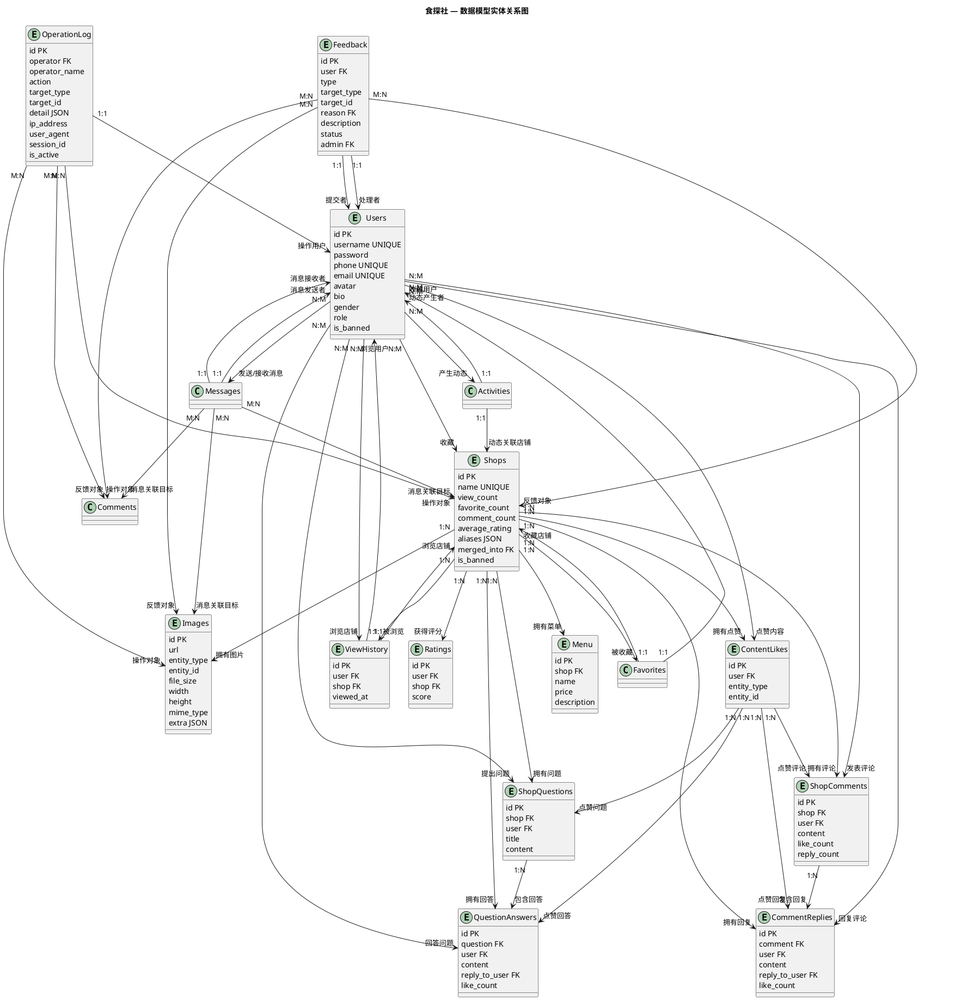

# 实体与关系

## 1. 实体列表

| 实体名 | 属性（含类型、主键标记） | 业务含义 | 约束说明 |
|--------|-------------------------|----------|----------|
| Users | id (PK), username (UNIQUE), password, phone (UNIQUE), email (UNIQUE), avatar, bio, gender, role, is_banned | 用户账户信息 | username、phone、email 唯一约束；is_banned 表示封禁状态 |
| Shops | id (PK), name (UNIQUE), view_count, favorite_count, comment_count, average_rating, aliases (JSON), merged_into (FK), is_banned | 店铺基本信息 | name 唯一约束；merged_into 自引用用于店铺合并 |
| Menu | id (PK), shop (FK), name, price, description | 菜单项信息 | 无唯一约束，但每个菜单项属于一个店铺 |
| Ratings | id (PK), user (FK), shop (FK), score | 用户评分记录 | (user_id, shop_id) 唯一约束 |
| Images | id (PK), url, entity_type, entity_id, file_size, width, height, mime_type, extra (JSON) | 图片资源 | entity_type + entity_id 组合唯一标识图片关联 |
| ShopComments | id (PK), shop (FK), user (FK), content, like_count, reply_count | 一级评论 | 无唯一约束，但每个评论属于一个店铺 |
| CommentReplies | id (PK), comment (FK), user (FK), content, reply_to_user (FK), like_count | 二级回复 | 无唯一约束，但每个回复属于一个一级评论 |
| ShopQuestions | id (PK), shop (FK), user (FK), title, content | 一级问题 | 无唯一约束，但每个问题属于一个店铺 |
| QuestionAnswers | id (PK), question (FK), user (FK), content, reply_to_user (FK), like_count | 二级回答 | 无唯一约束，但每个回答属于一个问题 |
| ContentLikes | id (PK), user (FK), entity_type, entity_id | 内容点赞记录 | 无唯一约束，通过 is_active 软删除实现点赞切换 |
| ViewHistory | id (PK), user (FK), shop (FK), viewed_at | 浏览历史记录 | (user_id, shop_id) 唯一约束保证每用户-店铺只有一条记录 |
| Feedback | id (PK), user (FK), type, target_type, target_id, reason (FK), description, status, admin (FK) | 反馈工单 | status 标识处理状态：pending/approved/rejected |
| OperationLog | id (PK), operator (FK), operator_name, action, target_type, target_id, detail (JSON), ip_address, user_agent, session_id, is_active | 操作日志记录 | is_active 用于软删除，仅系统内部维护 |

## 2. 关系列表

| 联系名 | 参与实体 | 联系类型 | 参与约束（是否可选） | 外键实现方式 |
|--------|----------|----------|----------------------|--------------|
| 用户-店铺 | Users ↔ Shops | N:M | 全部参与 | 用户收藏店铺 → Favorites (多态关联) |
| 用户-评论 | Users ↔ ShopComments | N:M | 全部参与 | 评论作者 → ShopComments.user (FK) |
| 用户-回复 | Users ↔ CommentReplies | N:M | 全部参与 | 回复作者 → CommentReplies.user (FK) |
| 用户-问题 | Users ↔ ShopQuestions | N:M | 全部参与 | 问题作者 → ShopQuestions.user (FK) |
| 用户-回答 | Users ↔ QuestionAnswers | N:M | 全部参与 | 回答作者 → QuestionAnswers.user (FK) |
| 用户-点赞 | Users ↔ ContentLikes | N:M | 全部参与 | 点赞用户 → ContentLikes.user (FK) |
| 用户-浏览历史 | Users ↔ ViewHistory | N:M | 全部参与 | 浏览用户 → ViewHistory.user (FK) |
| 用户-消息 | Users ↔ Messages | N:M | 全部参与 | 发送方/接收方 → Messages.sender/user (FK) |
| 用户-动态 | Users ↔ Activities | N:M | 全部参与 | 动态作者 → Activities.user (FK) |
| 用户-收藏 | Users ↔ Favorites | N:M | 全部参与 | 收藏用户 → Favorites.user (FK) |
| 店铺-菜单 | Shops ↔ Menu | 1:N | 全部参与 | 菜单所属店铺 → Menu.shop (FK) |
| 店铺-评分 | Shops ↔ Ratings | 1:N | 全部参与 | 评分对象 → Ratings.shop (FK) |
| 店铺-图片 | Shops ↔ Images | 1:N | 全部参与 | 图片所属店铺 → Images.entity_type='shop' |
| 店铺-评论 | Shops ↔ ShopComments | 1:N | 全部参与 | 评论所属店铺 → ShopComments.shop (FK) |
| 店铺-回复 | Shops ↔ CommentReplies | 1:N | 全部参与 | 回复所属店铺 → CommentReplies.comment.shop (FK) |
| 店铺-问题 | Shops ↔ ShopQuestions | 1:N | 全部参与 | 问题所属店铺 → ShopQuestions.shop (FK) |
| 店铺-回答 | Shops ↔ QuestionAnswers | 1:N | 全部参与 | 回答所属店铺 → QuestionAnswers.question.shop (FK) |
| 店铺-点赞 | Shops ↔ ContentLikes | 1:N | 全部参与 | 点赞对象 → ContentLikes.entity_type='shop' |
| 店铺-浏览历史 | Shops ↔ ViewHistory | 1:N | 全部参与 | 浏览店铺 → ViewHistory.shop (FK) |
| 店铺-收藏 | Shops ↔ Favorites | 1:N | 全部参与 | 收藏店铺 → Favorites.shop (FK) |
| 评论-回复 | ShopComments ↔ CommentReplies | 1:N | 全部参与 | 回复所属评论 → CommentReplies.comment (FK) |
| 问题-回答 | ShopQuestions ↔ QuestionAnswers | 1:N | 全部参与 | 回答所属问题 → QuestionAnswers.question (FK) |
| 评论-点赞 | ShopComments ↔ ContentLikes | 1:N | 全部参与 | 点赞对象 → ContentLikes.entity_type='shop_comment' |
| 问题-点赞 | ShopQuestions ↔ ContentLikes | 1:N | 全部参与 | 点赞对象 → ContentLikes.entity_type='shop_question' |
| 回复-点赞 | CommentReplies ↔ ContentLikes | 1:N | 全部参与 | 点赞对象 → ContentLikes.entity_type='comment_reply' |
| 回答-点赞 | QuestionAnswers ↔ ContentLikes | 1:N | 全部参与 | 点赞对象 → ContentLikes.entity_type='question_answer' |
| 字典-标签 | DictTypes ↔ DictData | 1:N | 全部参与 | 标签所属类型 → DictData.dict_type (FK) |
| 标签-实体 | DictData ↔ DictRel | 1:N | 全部参与 | 标签关联实体 → DictRel.dict_data (FK) |
| 实体-标签 | DictRel ↔ Entities | M:N | 全部参与 | 实体关联标签 → DictRel.entity_type/entity_id |
| 反馈-用户 | Feedback ↔ Users | 1:1 | 全部参与 | 反馈发起者 → Feedback.user (FK) |
| 反馈-管理员 | Feedback ↔ Users | 1:1 | 全部参与 | 反馈处理者 → Feedback.admin (FK) |
| 反馈-目标 | Feedback ↔ Shops / Comments / Images | M:N | 全部参与 | 反馈对象 → Feedback.target_type/target_id |
| 操作日志-用户 | OperationLog ↔ Users | 1:1 | 全部参与 | 操作用户 → OperationLog.operator (FK) |
| 操作日志-目标 | OperationLog ↔ Shops / Comments / Images | M:N | 全部参与 | 操作对象 → OperationLog.target_type/target_id |
| 动态-用户 | Activities ↔ Users | 1:1 | 全部参与 | 动态产生者 → Activities.user (FK) |
| 动态-店铺 | Activities ↔ Shops | 1:1 | 全部参与 | 动态关联店铺 → Activities.shop (FK) |
| 收藏-用户 | Favorites ↔ Users | 1:1 | 全部参与 | 收藏用户 → Favorites.user (FK) |
| 收藏-店铺 | Favorites ↔ Shops | 1:1 | 全部参与 | 收藏店铺 → Favorites.shop (FK) |
| 消息-用户 | Messages ↔ Users | 1:1 | 全部参与 | 消息接收者 → Messages.recipient (FK) |
| 消息-发送者 | Messages ↔ Users | 1:1 | 全部参与 | 消息发送者 → Messages.sender (FK) |
| 消息-目标 | Messages ↔ Shops / Comments / Images | M:N | 全部参与 | 消息关联目标 → Messages.related_entity_type/related_entity_id |
| 点赞-用户 | ContentLikes ↔ Users | 1:1 | 全部参与 | 点赞用户 → ContentLikes.user (FK) |
| 点赞-内容 | ContentLikes ↔ ShopComments / CommentReplies / ShopQuestions / QuestionAnswers | M:N | 全部参与 | 点赞内容 → ContentLikes.entity_type/entity_id |
| 浏览历史-用户 | ViewHistory ↔ Users | 1:1 | 全部参与 | 浏览用户 → ViewHistory.user (FK) |
| 浏览历史-店铺 | ViewHistory ↔ Shops | 1:1 | 全部参与 | 浏览店铺 → ViewHistory.shop (FK) |
| 数据库表间关系 | 所有表之间 | 部分参与 | 全部参与 | 通过外键和索引实现 |

## 3. 特殊说明

### 继承/泛化关系

无继承/泛化关系。

### 多值属性、派生属性的处理

- **平均评分**：在 Ratings 表中存储原始评分值，在 Shops 表中存储计算后的平均值。
- **浏览量**：在 Shops 表中存储累计浏览量。
- **收藏数**：在 Shops 表中存储累计收藏数。
- **评论数**：在 Shops 表中存储累计评论数。

### 弱实体

无弱实体。

## 4. 实体关系图（PlantUML）

> 使用 PlantUML 生成 ER 图步骤：
> 1. 将上述代码保存为 `.puml` 文件（如 `foodiehub.puml`）
> 2. 在支持 PlantUML 的工具中打开该文件（如 VS Code 插件、在线编辑器等）
> 3. 工具将自动生成 ER 图并提供导出功能（PNG/JPG/SVG）

此图展示了所有实体及其关系，可用于导入 PowerDesigner 或其他专业数据库设计工具进行进一步分析。