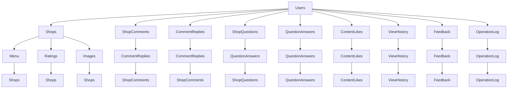

# 工具使用建议

## 1. PlantUML 图生成与导入

### 使用 PlantUML 生成 ER 图步骤：

1. **将上述代码保存为 `.puml` 文件**（如 `foodiehub.puml`）
2. **在支持 PlantUML 的工具中打开该文件**（如 VS Code 插件、在线编辑器等）
3. **工具将自动生成 ER 图并提供导出功能**（PNG/JPG/SVG）

### 导入 PowerDesigner 的步骤：

1. **安装 PowerDesigner** 并启动。
2. **选择“新建” → “数据库模型” → “ERD”**。
3. **点击菜单栏的“File” → “Import” → “PlantUML”**。
4. **选择你保存的 `.puml` 文件**，PowerDesigner 将自动解析并导入图。
5. **你可以对导入的图进行进一步编辑和优化**。

### 推荐工具：

- **VS Code**: 安装 PlantUML 插件，可以直接在编辑器内预览和导出 ER 图。
- **在线编辑器**: 如 [PlantUML Online](https://www.plantuml.com/plantuml) 或 [PlantUML Editor](https://plantuml.com/)，无需安装即可在线生成和导出 ER 图。
- **PowerDesigner**: 专业数据库设计工具，支持导入 PlantUML 格式，适合团队协作和正式项目。

## 2. SQL DDL 脚本生成与导入

### 使用 SQL DDL 脚本生成建表语句：

```sql
-- 创建 Users 表
CREATE TABLE Users (
    id INT PRIMARY KEY AUTO_INCREMENT,
    username VARCHAR(50) UNIQUE NOT NULL,
    password VARCHAR(255) NOT NULL,
    phone VARCHAR(20) UNIQUE NOT NULL,
    email VARCHAR(100) UNIQUE NOT NULL,
    avatar VARCHAR(255),
    bio TEXT,
    gender VARCHAR(10),
    role INT DEFAULT 0,
    is_banned BOOLEAN DEFAULT FALSE,
    created_at DATETIME DEFAULT CURRENT_TIMESTAMP,
    updated_at DATETIME DEFAULT CURRENT_TIMESTAMP ON UPDATE CURRENT_TIMESTAMP
);

-- 创建 Shops 表
CREATE TABLE Shops (
    id INT PRIMARY KEY AUTO_INCREMENT,
    name VARCHAR(100) UNIQUE NOT NULL,
    view_count INT DEFAULT 0,
    favorite_count INT DEFAULT 0,
    comment_count INT DEFAULT 0,
    average_rating FLOAT DEFAULT 0.0,
    aliases JSON,
    merged_into INT,
    is_banned BOOLEAN DEFAULT FALSE,
    created_at DATETIME DEFAULT CURRENT_TIMESTAMP,
    updated_at DATETIME DEFAULT CURRENT_TIMESTAMP ON UPDATE CURRENT_TIMESTAMP
);

-- 创建 Menu 表
CREATE TABLE Menu (
    id INT PRIMARY KEY AUTO_INCREMENT,
    shop_id INT NOT NULL,
    name VARCHAR(100) NOT NULL,
    price FLOAT,
    description TEXT,
    FOREIGN KEY (shop_id) REFERENCES Shops(id)
);

-- 创建 Ratings 表
CREATE TABLE Ratings (
    id INT PRIMARY KEY AUTO_INCREMENT,
    user_id INT NOT NULL,
    shop_id INT NOT NULL,
    score INT,
    FOREIGN KEY (user_id) REFERENCES Users(id),
    FOREIGN KEY (shop_id) REFERENCES Shops(id),
    UNIQUE (user_id, shop_id)
);

-- 创建 Images 表
CREATE TABLE Images (
    id BIGINT PRIMARY KEY AUTO_INCREMENT,
    url VARCHAR(255) NOT NULL,
    entity_type VARCHAR(32) NOT NULL,
    entity_id BIGINT NOT NULL,
    file_size INT,
    width INT,
    height INT,
    mime_type VARCHAR(50),
    extra JSON,
    FOREIGN KEY (entity_type, entity_id) REFERENCES ShopComments(id) OR CommentReplies(id) OR ShopQuestions(id) OR QuestionAnswers(id) OR Shop(id)
);

-- 创建 ShopComments 表
CREATE TABLE ShopComments (
    id BIGINT PRIMARY KEY AUTO_INCREMENT,
    shop_id INT NOT NULL,
    user_id INT NOT NULL,
    content TEXT NOT NULL,
    like_count INT DEFAULT 0,
    reply_count INT DEFAULT 0,
    FOREIGN KEY (shop_id) REFERENCES Shops(id),
    FOREIGN KEY (user_id) REFERENCES Users(id)
);

-- 创建 CommentReplies 表
CREATE TABLE CommentReplies (
    id BIGINT PRIMARY KEY AUTO_INCREMENT,
    comment_id BIGINT NOT NULL,
    user_id INT NOT NULL,
    content TEXT NOT NULL,
    reply_to_user_id INT,
    like_count INT DEFAULT 0,
    FOREIGN KEY (comment_id) REFERENCES ShopComments(id),
    FOREIGN KEY (user_id) REFERENCES Users(id),
    FOREIGN KEY (reply_to_user_id) REFERENCES Users(id)
);

-- 创建 ShopQuestions 表
CREATE TABLE ShopQuestions (
    id BIGINT PRIMARY KEY AUTO_INCREMENT,
    shop_id INT NOT NULL,
    user_id INT NOT NULL,
    title VARCHAR(100) NOT NULL,
    content TEXT,
    FOREIGN KEY (shop_id) REFERENCES Shops(id),
    FOREIGN KEY (user_id) REFERENCES Users(id)
);

-- 创建 QuestionAnswers 表
CREATE TABLE QuestionAnswers (
    id BIGINT PRIMARY KEY AUTO_INCREMENT,
    question_id BIGINT NOT NULL,
    user_id INT NOT NULL,
    content TEXT NOT NULL,
    reply_to_user_id INT,
    like_count INT DEFAULT 0,
    FOREIGN KEY (question_id) REFERENCES ShopQuestions(id),
    FOREIGN KEY (user_id) REFERENCES Users(id),
    FOREIGN KEY (reply_to_user_id) REFERENCES Users(id)
);

-- 创建 ContentLikes 表
CREATE TABLE ContentLikes (
    id BIGINT PRIMARY KEY AUTO_INCREMENT,
    user_id INT NOT NULL,
    entity_type VARCHAR(32) NOT NULL,
    entity_id BIGINT NOT NULL,
    FOREIGN KEY (user_id) REFERENCES Users(id)
);

-- 创建 ViewHistory 表
CREATE TABLE ViewHistory (
    id BIGINT PRIMARY KEY AUTO_INCREMENT,
    user_id INT NOT NULL,
    shop_id INT NOT NULL,
    viewed_at DATETIME DEFAULT CURRENT_TIMESTAMP,
    FOREIGN KEY (user_id) REFERENCES Users(id),
    FOREIGN KEY (shop_id) REFERENCES Shops(id),
    UNIQUE (user_id, shop_id)
);

-- 创建 Feedback 表
CREATE TABLE Feedback (
    id INT PRIMARY KEY AUTO_INCREMENT,
    user_id INT NOT NULL,
    type VARCHAR(20) NOT NULL,
    target_type VARCHAR(20) NOT NULL,
    target_id INT NOT NULL,
    reason_id INT NOT NULL,
    description TEXT,
    status VARCHAR(20) DEFAULT 'pending',
    admin_id INT,
    FOREIGN KEY (user_id) REFERENCES Users(id),
    FOREIGN KEY (admin_id) REFERENCES Users(id)
);

-- 创建 OperationLog 表
CREATE TABLE OperationLog (
    id BIGINT PRIMARY KEY AUTO_INCREMENT,
    operator_id INT,
    operator_name VARCHAR(50),
    action VARCHAR(50),
    target_type VARCHAR(50),
    target_id INT,
    detail JSON,
    ip_address VARCHAR(45),
    user_agent TEXT,
    session_id VARCHAR(64),
    is_active BOOLEAN DEFAULT TRUE,
    FOREIGN KEY (operator_id) REFERENCES Users(id)
);
```

### 导入 PowerDesigner 的步骤：

1. **安装 PowerDesigner** 并启动。
2. **选择“新建” → “数据库模型” → “ERD”**。
3. **点击菜单栏的“File” → “Import” → “SQL Script”**。
4. **选择你保存的 SQL 脚本文件**，PowerDesigner 将自动解析并导入表结构。
5. **你可以对导入的表结构进行进一步编辑和优化**。

### 推荐工具：

- **MySQL Workbench**: 支持导入 SQL 脚本，适合 MySQL 数据库。
- **pgAdmin**: 支持导入 SQL 脚本，适合 PostgreSQL 数据库。
- **PowerDesigner**: 专业数据库设计工具，支持导入 SQL 脚本，适合团队协作和正式项目。

## 3. 其他建议

### 使用 Mermaid 生成图表：

Mermaid 是一个轻量级的图表语法，适合快速预览。你可以将上面的 PlantUML 代码转换为 Mermaid 语法，然后在支持 Mermaid 的编辑器中查看。



### 推荐工具：

- **VS Code**: 安装 Mermaid 插件，可以直接在编辑器内预览和导出图表。
- **在线编辑器**: 如 [Mermaid Live Editor](https://mermaid.live/edit)，无需安装即可在线预览和导出图表。
- **PowerDesigner**: 专业数据库设计工具，支持导入 Mermaid 图表。

## 4. 总结

- **PlantUML**: 适合生成高质量 ER 图，支持 PowerDesigner 导入。
- **SQL DDL**: 适合直接导入数据库，适合逆向工程。
- **Mermaid**: 适合快速预览和分享，适合团队协作。

根据你的需求选择合适的工具，可以大大提高工作效率和准确性。